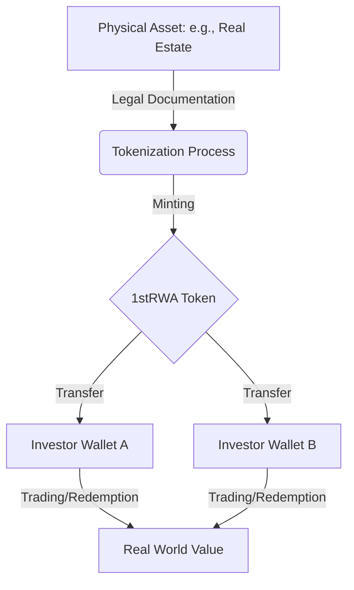

# Understanding MyFirstTokenERC20RWA

Welcome to a hands-on guide that will help you build your first Real World Asset token from the ground up. I will walk you through every concept and piece of code, assuming you have no prior experience with blockchain technology or cryptocurrency. My goal is to transform complex ideas into clear understanding, so you can confidently create tokens that comply with real-world regulatory requirements.

This tutorial is built on a simple but powerful premise: you learn by doing. You will start with a working smart contract that already implements all the mechanisms needed for regulated asset tokenization. I will explain how each part functions, why it exists, and how it connects to the broader framework of financial compliance. By the end, you won't just have run a deployment script; you will understand how to design tokens that meet regulatory standards, how to manage administrative roles, and how to build interfaces that let legitimate users interact safely with your creation.

The project provides a complete, ready-to-fork solution. The smart contract combines several OpenZeppelin extensions to deliver features that traditional tokens lack. You will discover how the freezing mechanism immobilizes suspicious accounts while leaving legitimate holdings accessible, how the restriction system creates an allowlist for verified investors, and how role-based access control distributes authority across multiple administrators. The accompanying Next.js dashboard demonstrates how these contract features translate into a usable web interface where users can mint tokens, transfer them, and monitor activity in real-time.

I want to be clear about what you will achieve. You will learn how to deploy a token on the Ethereum Sepolia testnet, a safe environment that mimics the real blockchain without financial risk. You will configure environment variables, connect a wallet, and interact with the live contract. You will understand the distinction between public functions anyone can call and privileged functions that require specific roles. You will see how events create an immutable audit trail that regulators can inspect. You will grasp how the permit system saves gas by allowing off-chain approvals. You will understand why the token is paused using the Pausable extension and how the recovery function rescues tokens from mistakes.

The regulatory framework emerges from careful design choices. The allowlist system ensures only approved participants can receive tokens, satisfying know-your-customer requirements. The minting restriction guarantees that new tokens appear only when authorized, maintaining the link between token supply and real asset backing. The freezing capability provides a response mechanism for legal orders or investigations. The pause function acts as an emergency stop when vulnerabilities are discovered. The recovery role offers a safety net for human error. Together these features create a governance structure that mirrors traditional finance but operates on-chain.

This is not theoretical. The code you will study is production-grade, inheriting from OpenZeppelin's audited libraries. The frontend uses Wagmi and RainbowKit for secure wallet interactions. Every line has a purpose. I will show you the constructor where roles get assigned, the overrides that chain multiple security checks, the events that broadcast important state changes, and the modifiers that guard privileged functions. You will learn how the _update function serves as a central gatekeeper, running checks from all parent contracts before any balance changes.

The learning journey proceeds in stages. First you will understand the big picture: what an RWA token represents and how it flows from physical asset to digital ownership. Then you will prepare your environment: install dependencies, acquire testnet ETH from a faucet, and set up your wallet. Next you will deploy the contract and observe which addresses hold administrative powers. After that you will explore the contract code itself, starting with Solidity fundamentals and moving through each extension in detail. Finally you will use the dashboard to execute transactions, trigger events, and see how the system responds.

My approach balances depth with accessibility. When I introduce Solidity concepts, I relate them to programming languages you might already know. When I explain mapping structures, I show you how they act like dictionaries that live on the blockchain. When I discuss gas costs, I clarify why some functions are free while others require payment. When I cover role management, I illustrate how distributed control prevents any single point of failure. You will encounter tables that summarize key terms, role responsibilities, and restriction states. These tables condense information into scannable formats without resorting to lists.

What makes this tutorial particularly valuable is that you are working with a complete system, not isolated snippets. The token contract, the frontend application, and the deployment scripts form an integrated whole. You can modify any part and see the effects immediately. You can add new roles, change restriction logic, or extend the UI. The code is yours to experiment with, and understanding comes from that experimentation.

I have written this with absolute beginners in mind. If you have never heard of Ethereum, if you don't know what a wallet is, if terms like "minting" and "burning" sound unfamiliar, this guide is for you. I define every term when it first appears. I use analogies that connect to everyday experiences. I avoid jargon unless I immediately explain it. When I reference concepts like keccak256 hashes or custom errors, I provide context so you understand their purpose.

Now let us begin. Take a deep breath and trust the process. You are about to unlock a skill that sits at the intersection of finance, technology, and law. This knowledge will serve you whether you become a developer building tokenization platforms, a compliance officer evaluating protocols, or an entrepreneur launching new financial products. The RWA space is growing rapidly, and understanding its technical foundations positions you to participate meaningfully.

Ready to start? Open your terminal, look at the project structure, and let's take the first step together.

## Quick Start: The Big Picture

Think of a **Real World Asset (RWA) Token** like a digital "title deed." Normally, if you own a piece of a building or a bar of gold, you have a paper contract. On the blockchain, we represent that ownership with a **token**.

1.  **Selection**: A physical asset (like real estate) is identified.
2.  **Tokenization**: We create a digital token (like `1stRWA`) that represents a specific share of that asset.
3.  **Ownership**: You hold the token in your digital wallet, proving your ownership. If the asset gains value, your token represents that gain.

### The RWA Lifecycle



## Before You Begin

To follow along with this project and interact with the dashboard, you will need:

1.  **A Digital Wallet**: Most people use **MetaMask**. It's a browser extension that acts as your ID and your bank on the blockchain.
2.  **Testnet Currency (Sepolia ETH)**: This project runs on the **Sepolia Test Network**. This is a "practice" blockchain where "money" is free. You can get some from a "faucet" (a website that gives away small amounts of test ETH).
3.  **Basic Understanding of "Gas"**: Every action on the blockchain (like sending tokens) costs a tiny amount of "Gas." On Sepolia, this is paid using your test ETH.

## Deployment and Configuration

### Funding Your Deployment Account

To deploy the contract, I need Sepolia ETH for gas fees. Gas is the fee paid to network validators for processing transactions. On the Sepolia test network, this ETH is free and has no real-world value. I can acquire it from public faucets that distribute test ETH to anyone who requests it.

A faucet is simply a website where I enter my wallet address and receive a small amount of ETH. Here are some reliable sources I can use:

| Faucet | How it works | Amount given | Things to know |
|--------|--------------|--------------|----------------|
| Alchemy Sepolia Faucet | Visit the site, paste wallet address, click request | 0.5 ETH per day | Requires a free Alchemy account |
| Infura Sepolia Faucet | Sign in with GitHub, enter address, claim | 0.1 ETH per day | One claim per GitHub account daily |
| Chainlink Faucet | Complete a captcha, submit address | 0.1 ETH | No account needed, limited hourly |
| Sepolia PoW Faucet | Solve a small computational puzzle | Varies based on difficulty | Requires some CPU time |

I should add my wallet address to MetaMask's Sepolia network before requesting funds. Once I submit the request, the ETH arrives in my wallet within seconds to a few minutes. I recommend getting at least 0.5 ETH total to cover deployment costs and multiple test transactions. Having a buffer ensures I don't run out of gas during testing.

### Environment Variables

The Next.js frontend requires configuration to connect to my deployed contract and wallet services. I store these values in a `.env.local` file at the root of the project. This file stays out of version control to protect any sensitive keys.

The key environment variables are:

| Variable | What it does | Where to obtain it | Example format |
|----------|--------------|--------------------|----------------|
| `NEXT_PUBLIC_WALLET_CONNECT_PROJECT_ID` | Authenticates my app with WalletConnect, enabling wallet connections | Create a project at cloud.walletconnect.com | `a1b2c3d4e5f6...` |
| `NEXT_PUBLIC_CONTRACT_ADDRESS` | Tells the frontend which contract to interact with on the blockchain | Copy from deployment output after running the script | `0x1234567890abcdef...` |
| `NEXT_PUBLIC_SEPOLIA_RPC_URL` (optional) | Provides a direct endpoint to Sepolia nodes, improving reliability | From Alchemy or Infura project dashboard | `https://eth-sepolia.g.alchemy.com/v2/your-key` |

The `NEXT_PUBLIC_` prefix is required for Next.js to expose these variables to the browser. Without it, the variables remain server-only and the frontend cannot access them.

The `WALLET_CONNECT_PROJECT_ID` is free to obtain and only identifies my application; it does not expose private keys. I sign up at WalletConnect Cloud, create a new project named something like "My RWA Token", and copy the Project ID.

The `CONTRACT_ADDRESS` changes every time I redeploy. After running `npx hardhat run scripts/deploy.js --network sepolia`, the console prints a line like "deployed to: 0x...". I copy that exact address into my `.env.local` file.

If I skip setting these variables, the dashboard will not be able to connect to wallets or find my token contract, and I'll see connection errors in the browser console.

### Deploying and Configuring Your Contract

Deployment brings my token contract onto the Sepolia testnet where anyone can interact with it. The project includes a ready-to-use deployment script that handles compilation and deployment in one step.

I open a terminal in the project root and run:

```bash
npx hardhat run scripts/deploy.js --network sepolia
```

This command compiles the Solidity contracts, connects to Sepolia via my configured RPC, and deploys them using the account that is set as the default deployment account in Hardhat. The script prints the contract address and the role assignments to the console.

As soon as I see the deployed address, I copy it into my `.env.local` file under `NEXT_PUBLIC_CONTRACT_ADDRESS`. If I make changes to the contract and redeploy, I repeat this step to update the address.

The deployment also outputs which accounts hold the five administrative roles (default admin, pauser, minter, freezer, limiter, recovery). I can use these addresses to log into the dashboard and test the admin features. By default, the first account from Hardhat's sample accounts receives all roles, but I can modify the script to assign different addresses.

Once the environment variables are set and the contract is deployed, I start the Next.js development server:

```bash
npm run dev
```

Visiting `http://localhost:3000/dashboard` shows the interface. I connect my wallet, and if my address matches one of the role holders, the admin buttons appear. I can now mint tokens, transfer them, freeze balances, and monitor the activity feed.

Should I ever need to redeploy, I just run the deployment command again, update the contract address in `.env.local`, and restart the dev server. The changes are reflected immediately. This simple workflow lets me iterate quickly while learning how the contract behaves on a live network.

## Key Terms to Know

| Term | Simple Explanation |
| :--- | :--- |
| **Address** | Your digital "mailbox" (e.g., `0x123...`). It's where your tokens live. |
| **Mint** | Creating new tokens out of thin air (authorized roles only). |
| **Burn** | Destroying tokens (usually to redeem the underlying asset). |
| **Role** | Permission levels. Like having an "Admin" or "Moderator" badge. |
| **Transaction** | Any action that changes the blockchain state (costs gas). |
| **Smart Contract** | A program that lives on the blockchain and follows strict rules. |

## What Is This Token

This is called MyFirstTokenERC20RWA. The name tells us several things. It follows the ERC20 standard which means it behaves like other tokens you might have heard about such as USDC or DAI. The RWA part stands for Real World Asset. This means the token represents something tangible in the physical world. It could represent ownership of real estate, commodities, or other physical assets. The token exists on the blockchain but it connects to real value in our world.

The token symbol is 1stRWA and that appears in the constructor function on line 22. When I see this I understand this is the ticker symbol that will appear on wallets and exchanges.

```solidity
constructor(address defaultAdmin, address pauser, address minter, address freezer, address limiter, address recoveryAdmin)
    ERC20("MyFirstTokenERC20RWA", "1stRWA")
    ERC20Permit("MyFirstTokenERC20RWA")
{
```

## What Is A Smart Contract

A smart contract is simply a program that runs on a blockchain. Think of it like a vending machine. Once you deploy it, it follows its programmed rules without anyone being able to change them. The code here is written in Solidity which is the main language for Ethereum blockchain programs. When I deploy this contract it creates a new token that anyone can interact with according to the rules encoded here.

## Solidity Fundamentals: Your Building Blocks

When I approach Solidity, I want to think of it as a familiar language with some new twists. I'm already comfortable with programming concepts, so I'll map Solidity's features to what I know while highlighting its unique aspects for blockchain programming. This section will walk you through the fundamental building blocks you need to understand before diving into the token contract.

### Think of Contracts Like Digital Legal Agreements

A smart contract is similar to a real world contract. It establishes rules that all parties must follow. Once it's deployed to the blockchain, those rules cannot be changed. Everyone who interacts with it must abide by its terms. Solidity is the programming language we use to write these contracts. It looks a lot like JavaScript or C++ but with important differences because it runs on a decentralized network rather than a single computer.

When I write a Solidity contract, I'm essentially creating a small program that lives at a specific address on the blockchain. Anyone can send transactions to that address to trigger its functions. The contract maintains its own data storage that persists between transactions. This is revolutionary because it means I can create systems that run automatically without any central authority controlling them.

### The Anatomy of a Solidity Contract

Let me start with the simplest possible example to understand the structure.

```solidity
// SPDX-License-Identifier: MIT
pragma solidity ^0.8.19;

contract SimpleStorage {
    // State variables
    uint256 public storedNumber;
    string public storedText;
    address public owner;
    
    // Constructor runs once during deployment
    constructor() {
        owner = msg.sender;
        storedNumber = 42;
    }
    
    // Public function that anyone can call
    function setNumber(uint256 newNumber) public {
        storedNumber = newNumber;
    }
    
    // Public view function - free to call, doesn't change state
    function getNumber() public view returns (uint256) {
        return storedNumber;
    }
    
    // Function with access control
    function updateText(string memory newText) public {
        require(msg.sender == owner, "Only the owner can update the text");
        storedText = newText;
    }
}
```

Let me break down what each part means.

The first line tells the compiler what license this code uses. This is important for open source compliance. The second line specifies which version of Solidity I'm using. The `^0.8.19` means I can use compiler versions 0.8.19 and higher but not 0.9.0. This ensures the behavior is predictable.

The `contract SimpleStorage` line defines a new contract named SimpleStorage. Inside the braces I have state variables and functions.

**State variables** are like the contract's memory. They permanently store data on the blockchain. `storedNumber` holds an unsigned integer. The `public` keyword automatically creates a getter function so anyone can read its value. `storedText` holds a string of text. `owner` holds an Ethereum address.

The **constructor** is a special function that runs exactly once when the contract is first deployed. After that, it never runs again. In this example, the constructor records who deployed the contract (using `msg.sender`) and sets an initial value for `storedNumber`.

Then I have three **functions**. `setNumber` allows anyone to change the stored number. `getNumber` allows anyone to read the number but cannot change anything because it's marked `view`. `updateText` only allows the contract owner to change the text, enforced by the `require` statement.

This simple example shows all the core concepts: state storage, functions with different visibility, reading and writing data, and basic access control.

### Variables and Types: What Data Can Contracts Store?

Solidity has several built-in types. Understanding them helps me design efficient contracts.

| Category | Type | Description | Example |
|----------|------|-------------|---------|
| **Boolean** | `bool` | True or false values | `bool isActive = true;` |
| **Integer** | `uint256` | Unsigned integer, 256 bits | `uint256 count = 100;` |
| | `int256` | Signed integer, 256 bits | `int256 temperature = -5;` |
| | `uint8` to `uint256` | Fixed-size unsigned | `uint8 smallNum = 42;` |
| **Address** | `address` | 20-byte Ethereum address | `address owner = 0x...;` |
| | `address payable` | Address that can receive ETH | `address payable recipient = ...;` |
| **Bytes** | `bytes` | Dynamic byte array | `bytes memory data = "hello";` |
| | `bytes32` | Fixed 32-byte array | `bytes32 hash = keccak256(...);` |
| **String** | `string` | UTF-8 encoded text | `string memory name = "Alice";` |

**Boolean (bool)** holds true or false values. Booleans are useful for flags and conditions.

```solidity
bool public isActive = true;
bool public isPaused = false;
```

**Integers** come in two flavors: unsigned (`uint`) and signed (`int`). The number after `uint` or `int` specifies how many bits the number uses. `uint256` is the most common because it's the native word size of the Ethereum Virtual Machine.

```solidity
uint256 public totalSupply = 1000000;  // Up to about 1.16e77
uint128 public smallerNumber = 500;     // Uses less storage than uint256
int256 public temperature = -15;        // Can be negative
```

**Addresses** are special types that hold Ethereum account addresses. An address is 20 bytes (160 bits) and looks like `0x742d35Cc6634C0532925a3b844Bc454e4438f44e`. There are two kinds: plain `address` and `address payable` which can receive Ether.

```solidity
address public userWallet;                    // Can only check balance
address payable public recipient;             // Can receive payments
```

**Bytes and strings** handle text and binary data. `string` is for UTF-8 encoded text. `bytes` is for raw binary data. For fixed-size data, I can use `bytes32` which is exactly 32 bytes.

```solidity
string public tokenName = "MyToken";
bytes32 public constant TOKEN_SYMBOL = keccak256("MYT");  // Fixed 32-byte hash
```

**Arrays** hold multiple values of the same type. They can be fixed-size or dynamic.

```solidity
uint256[5] public fixedArray;           // Exactly 5 elements
uint256[] public dynamicArray;          // Can grow or shrink
address[] public adminList;             // List of admin addresses
```

**Structs** let me define custom data types that group related values together.

```solidity
struct TokenHolder {
    uint256 balance;
    uint256 frozenAmount;
    bool isVerified;
    uint256 lastActive;
}

TokenHolder public holderInfo;
```

**Mappings** are like dictionaries or hash maps. They store key-value pairs where the key can be any value type (usually addresses) and the value is any type.

```solidity
mapping(address => uint256) public balances;                    // Address to balance
mapping(address => bool) public isWhitelisted;                 // Address to boolean
mapping(uint256 => TokenHolder) public tokenHolders;           // Token ID to holder info
```

Mappings are incredibly important in token contracts. They efficiently store per-account data like balances, allowances, and restrictions.

| Type | Description | Where it lives |
|------|-------------|----------------|
| `array` | Ordered collection | `storage` (persistent) or `memory` (temporary) |
| `struct` | Custom record type | Usually `storage` |
| `mapping` | Key-value dictionary | `storage` only |

### Function Deep Dive: How Contracts Execute Actions

Functions are where the action happens. Let me examine their different aspects in detail.

| Aspect | Options | Meaning |
|--------|---------|---------|
| **Visibility** | `public` | Callable by anyone (external or internal) |
| | `external` | Only callable from outside the contract |
| | `internal` | Only callable within this contract or derived contracts |
| | `private` | Only callable within this contract |
| **Mutability** | `view` | Reads state but doesn't modify it (no gas) |
| | `pure` | Doesn't read or modify state (no gas) |
| | `payable` | Can receive ETH with the call |
| **Returns** | `returns (type)` | Specifies what values the function outputs |

**Visibility** determines who can call a function.

- `public`: Anyone can call this function, from inside or outside the contract. The compiler automatically creates a public getter for public state variables.
- `external`: Only external accounts (user wallets or other contracts) can call this function. It cannot be called from within the same contract unless using `this.functionName()`.
- `internal`: Only this contract and contracts that inherit from it can call the function. External accounts cannot call it directly.
- `private`: Only this contract can call the function. Even inheriting contracts cannot access it.

```solidity
function publicFunction() public {}      // Anyone, anywhere
function externalFunction() external {}  // Only external calls
function internalFunction() internal {}  // Only this contract + children
function privateFunction() private {}    // Only this contract
```

**Mutability** describes what the function does to contract state.

- `view`: The function promises not to modify state. It can only read data. Calling a view function doesn't cost gas if you call it from outside the contract (though it still costs gas if called from within a transaction).
- `pure`: The function promises not to read or modify state. It only uses its inputs and performs calculations.
- `payable`: The function can receive Ether along with the call.

```solidity
function getBalance(address account) public view returns (uint256) {
    return balances[account];  // Just reading, no modification
}

function calculateTotal(uint256 a, uint256 b) public pure returns (uint256) {
    return a + b;  // No state access at all
}

function deposit() public payable {
    // This function can receive Ether
    balances[msg.sender] += msg.value;
}
```

**Return values** specify what data the function sends back to the caller.

```solidity
// Single return value
function getOwner() public view returns (address) {
    return owner;
}

// Multiple return values
function getAccountInfo(address account) public view returns (uint256 balance, uint256 frozen) {
    balance = balances[account];
    frozen = frozenBalances[account];
}

// Named return variables
function getTokenData() public view returns (uint256 total, string memory name) {
    total = totalSupply();
    name = tokenName;
}
```

I can destructure multiple return values when calling the function:

```solidity
(balance, frozen) = getAccountInfo(userAddress);
```

### Special Variables and Function Parameters

Solidity provides special global variables that give me information about the current transaction and blockchain context.

- `msg.sender`: The address that called this function (changes if the function calls another contract)
- `msg.value`: The amount of wei (1 ETH = 10^18 wei) sent with the call
- `msg.data`: The complete calldata (function selector + parameters)
- `block.timestamp`: Current block timestamp in seconds since Unix epoch
- `block.number`: Current block number
- `block.chainid`: The chain ID of the current blockchain
- `tx.origin`: The original transaction sender (not recommended for access control due to phishing risks)

```solidity
function safeTransfer(address to, uint256 amount) public {
    require(block.timestamp >= startTime, "Not yet started");
    require(msg.value == 0, "Do not send ETH with this call");
    require(balances[msg.sender] >= amount, "Insufficient balance");
    
    balances[msg.sender] -= amount;
    balances[to] += amount;
    
    emit Transferred(msg.sender, to, amount, block.timestamp);
}
```

### The Magic of Modifiers: Reusable Security Checks

Modifiers are one of Solidity's most powerful features. They let me write reusable code that runs before or after a function. Think of them as security guards that check credentials before letting a function execute.

Here's a simple modifier that restricts a function to the contract owner.

```solidity
address public owner;

modifier onlyOwner() {
    require(msg.sender == owner, "Not authorized");
    _;  // This is where the original function gets inserted
}
```

Notice the `_;` line. That's where Solidity inserts the rest of the function. It's crucial. Without it, the modifier would replace the function entirely.

Now I can use this modifier on any function:

```solidity
function emergencyShutdown() public onlyOwner {
    // Only the owner can execute this code
    _pause();
}

function updateParameters(uint256 newValue) public onlyOwner {
    // Only the owner can execute this too
    parameters = newValue;
}
```

Modifiers can also take parameters:

```solidity
modifier onlyAddresses(address[] memory allowed) {
    require(allowed.length > 0, "No addresses specified");
    bool found = false;
    for (uint256 i = 0; i < allowed.length; i++) {
        if (msg.sender == allowed[i]) {
            found = true;
            break;
        }
    }
    require(found, "Sender not in allowed list");
    _;
}

// Usage
function privilegedAction() public onlyAddresses(adminAddresses) {
    // This runs only if msg.sender is in the adminAddresses array
}
```

### Events: The Communication Bridge

Events are how smart contracts talk to the outside world. When something important happens, I `emit` an event. External applications (wallets, dashboards, indexers) listen for these events and react accordingly.

```solidity
event Transfer(address indexed from, address indexed to, uint256 amount);
event Approval(address indexed owner, address indexed spender, uint256 amount);
```

The `indexed` keyword is important. Indexed parameters get stored in a special "topic" field that can be efficiently searched. Non-indexed parameters are just stored in the event data.

When I emit an event:

```solidity
emit Transfer(fromAddress, toAddress, transferAmount);
```

This creates a permanent record in the blockchain's transaction logs. Anyone can search for all Transfer events to analyze token movements. Indexed parameters make it fast to find all transfers involving a specific address.

Events cost much less gas than storing the same data in state variables, which is why they're perfect for public notifications. They provide an audit trail that regulators, auditors, and users can examine forever.

### Error Handling: Knowing What Went Wrong

Solidity gives me several ways to handle errors. The traditional approach uses `require`, `assert`, and `revert`.

- `require(condition, errorMessage)`: Checks that a condition is true. If false, reverts the transaction and optionally displays an error message. Used for validating inputs and preconditions. Gas is refunded for remaining gas.
- `assert(condition)`: Used for internal consistency checks. If the condition is false, it indicates a bug. The transaction reverts and does NOT refund remaining gas. Use sparingly.
- `revert()`: Immediately reverts the transaction, undoing all state changes. Can include an error message.

```solidity
function transfer(address to, uint256 amount) public {
    require(to != address(0), "Invalid recipient");
    require(balances[msg.sender] >= amount, "Insufficient balance");
    require(!isFrozen[msg.sender], "Account is frozen");
    
    balances[msg.sender] -= amount;
    balances[to] += amount;
    
    emit Transfer(msg.sender, to, amount);
}
```

**Custom errors** are a newer, more gas-efficient pattern. I define them like this:

```solidity
error InsufficientBalance(address account, uint256 available, uint256 needed);
error TransferToSelf(address from, address to);
error NotAllowed(address account);
```

Then use them with `revert`:

```solidity
function transfer(address to, uint256 amount) public {
    if (balances[msg.sender] < amount) {
        revert InsufficientBalance(msg.sender, balances[msg.sender], amount);
    }
    if (from == to) {
        revert TransferToSelf(msg.sender, msg.sender);
    }
    
    balances[msg.sender] -= amount;
    balances[to] += amount;
    
    emit Transfer(msg.sender, to, amount);
}
```

Custom errors are better because:
1. They cost less gas (only 4 bytes instead of the full error string)
2. They carry structured data that wallets and tools can parse
3. They appear clearly in transaction receipts with the error name and parameters

### Storage, Memory, and Call Data: Where Data Lives

This is one of the most important concepts to understand. Where I store data determines its persistence and the gas costs involved.

**Storage** is persistent on the blockchain. All state variables use storage. Reading from storage costs some gas. Writing to storage costs much more gas (about 20,000 gas for the first write to a slot, 5,000 gas for updates). Storage is expensive because it permanently changes the blockchain state.

```solidity
contract StorageExample {
    uint256 public storedValue;      // Stored in storage
    address public ownerAddress;      // Stored in storage
    mapping(address => uint256) public balances; // Mapping stored in storage
    
    // Every time I write to these variables, I pay significant gas
}
```

**Memory** is temporary. It exists only during the execution of a function. Memory is much cheaper than storage. Allocating and using memory costs gas but it's reclaimed after the function finishes. Memory is not persistent between function calls.

```solidity
function processArray(uint256[] memory data) public pure returns (uint256 sum) {
    // The `data` parameter lives in memory
    // It exists only during this function call
    for (uint256 i = 0; i < data.length; i++) {
        sum += data[i];
    }
    // Memory is freed when this function returns
}
```

**Calldata** is similar to memory but it's read-only and stores function arguments. It's cheaper than memory for external function parameters.

```solidity
function processArray(uint256[] calldata data) external {
    // data is in calldata - read-only, cheapest option
    // Cannot modify data in calldata
}
```

Variables declared inside functions without `storage` or `memory` keywords are by default in memory:

```solidity
function example() public {
    uint256 localNumber = 42;      // In memory
    string memory localString = "hello"; 
}
```

### The Power of Inheritance: Combining Contracts

Inheritance lets me create new contracts by building on existing ones. This is crucial for Solidity because it promotes code reuse and modularity. OpenZeppelin contracts are designed to be inherited.

```solidity
contract Parent {
    uint256 public parentValue;
    
    function parentFunction() public virtual returns (string memory) {
        return "parent";
    }
}

contract Child is Parent {
    // Child inherits parentValue and parentFunction
    
    function childFunction() public returns (string memory) {
        return "child";
    }
    
    // Override parentFunction
    function parentFunction() public virtual override returns (string memory) {
        return "child override";
    }
}
```

The `virtual` keyword on parent functions allows child contracts to override them. The `override` keyword on child functions tells the compiler "I'm overriding a virtual function from a parent."

**Multiple inheritance** is allowed but requires careful ordering. The compiler uses C3 linearization to determine the order. When calling `super.functionName()`, it calls the function in the next contract in the inheritance hierarchy.

```solidity
contract A { function f() public virtual returns (string memory) { return "A"; } }
contract B is A { function f() public virtual override returns (string memory) { return "B"; } }
contract C is A { function f() public virtual override returns (string memory) { return "C"; } }
contract D is B, C {
    // Which parent's function does D inherit?
    // Solidity uses C3 linearization: D, B, C, A
    // So D.f() returns "B" because B comes before C in the linearization
}
```

### The Big Picture: Solidity in Context

When I write a Solidity contract, I'm creating a closed-box program with specific rules. The code executes on every node in the network. I must be precise because there's no room for interpretation. My functions either succeed completely or revert entirely. There is no partial execution. Either all state changes happen, or none of them happen. This is called atomicity and it's essential for blockchain consistency.

The language is designed for safety and predictability. I can't create arbitrary loops that might run forever because the Ethereum Virtual Machine enforces gas limits on each transaction. Every operation costs gas. When the gas runs out, the transaction reverts. This prevents infinite loops but also means I need to be mindful of computational costs.

I can't delete arbitrary storage without special functions. Once data is on the blockchain, it stays there forever unless I use `selfdestruct` (which also has restrictions). This permanence is both a feature and a responsibility.

But the constraints lead to creative patterns. I use modifiers for access control. I emit events for transparency. I inherit from battle-tested libraries like OpenZeppelin. My contract becomes a trustless, automated system that anyone can interact with globally.

That's the essence of Solidity: a language for building unstoppable agreements. Once deployed, the contract runs exactly as programmed, without any single person or organization being able to stop it. This creates opportunities for automated trust that traditional systems cannot match.

## Understanding The Imports

One of the most powerful aspects of Solidity development is code reuse through imports. OpenZeppelin has developed a comprehensive library of secure, audited smart contract components. Rather than writing every token feature from scratch, I import these battle-tested building blocks and combine them to create exactly what I need. Let me walk through each import in detail and explain why it's essential for this RWA token.

### The Import Philosophy: Building on Solid Foundations

Imagine I wanted to build a house. I could forge my own nails, mix my own concrete, and cut my own lumber. But it makes much more sense to use standardized materials from reputable suppliers. That's what OpenZeppelin provides for smart contracts: standardized, security-reviewed components that follow established patterns.

Each OpenZeppelin contract has been used in thousands of deployments and audited by multiple security firms. They represent collective wisdom about how to implement token standards safely. By inheriting from these contracts, I gain all that expertise.

The import statements use the syntax `{ContractName} from "path"`. The curly braces allow me to rename the imported contract if I want, though I'm using the original names here.

### Line by Line: Each Import's Purpose

**Import 1: ERC20Freezable**

```solidity
import {ERC20Freezable} from "@openzeppelin/community-contracts/contracts/token/ERC20/extensions/ERC20Freezable.sol";
```

This is the freezing mechanism. The path indicates it's in the "community-contracts" package rather than the main OpenZeppelin contracts. This is important because ERC20Freezable implements an emerging standard (EIP-7943) for fungible tokens with freezing capabilities and it's still in community review. Nevertheless, it's well-designed and follows established patterns.

Why do I need freezing? For RWA tokens, regulatory compliance often requires the ability to immobilize tokens when there are legal orders, investigations, or suspicious activity. Freezing is distinguishable from simply blocking an account because it can freeze specific amounts while leaving other tokens accessible. This allows nuanced responses: if part of an account's holdings are problematic, only that portion gets frozen. The rest remains usable.

**Import 2: ERC20Restricted**

```solidity
import {ERC20Restricted} from "@openzeppelin/community-contracts/contracts/token/ERC20/extensions/ERC20Restricted.sol";
```

This provides the allowlist/blocklist functionality. Regulatory frameworks for securities tokens typically restrict who can hold the token. Only verified investors should be able to receive tokens. ERC20Restricted implements this by maintaining a restriction state for each address.

This is particularly important for RWA tokens that represent regulated assets. The default pattern is a blocklist: anyone can hold tokens unless specifically blocked. But MyFirstTokenERC20RWA overrides this to implement an allowlist: only explicitly approved addresses can hold tokens. This is the gold standard for regulated token offerings.

**Import 3: AccessControl**

```solidity
import {AccessControl} from "@openzeppelin/contracts/access/AccessControl.sol";
```

AccessControl is OpenZeppelin's role-based permission system. It's the backbone of administrative security. Instead of having a single admin address that can do everything, I define multiple roles (pauser, minter, freezer, etc.) and grant each role to specific addresses. This creates separation of duties and prevents any single account from having too much power.

AccessControl uses byte32 identifiers for roles. It stores which addresses hold which roles and provides functions to grant and revoke roles. Only the DEFAULT_ADMIN_ROLE holder can manage roles. This is the standard pattern for multi-role systems in Ethereum.

**Import 4: ERC20**

```solidity
import {ERC20} from "@openzeppelin/contracts/token/ERC20/ERC20.sol";
```

This is the foundation. ERC20 is the fundamental token standard on Ethereum. Every token follows this interface. It defines the basic functions: `balanceOf`, `transfer`, `allowance`, `approve`, `transferFrom`. It also defines the `Transfer` and `Approval` events that all tokens emit.

OpenZeppelin's ERC20 implementation is gas-optimized and includes proper overflow protection using Solidity 0.8's built-in checks. It maintains the balances mapping and handles the core token logic. I cannot skip this import because all other extensions build upon it.

**Import 5: ERC1363**

```solidity
import {ERC1363} from "@openzeppelin/contracts/token/ERC20/extensions/ERC1363.sol";
```

ERC1363 adds "token callback" functionality. The standard ERC20 only lets me transfer tokens or approve spending. ERC1363 extends this by adding functions like `transferAndCall` and `approveAndCall`. These functions transfer tokens and then automatically call a function on the recipient contract in the same transaction.

This is useful for token payment systems. For example, if I'm paying a service that requires tokens, I can use `transferAndCall` to both send tokens and trigger the service's "received payment" function atomically. It eliminates the need for a two-step process where I transfer tokens and then separately notify the recipient.

**Import 6: ERC20Burnable**

```solidity
import {ERC20Burnable} from "@openzeppelin/contracts/token/ERC20/extensions/ERC20Burnable.sol";
```

Burnable tokens can be destroyed. When a holder burns tokens, they disappear from circulation and the total supply decreases. This is essential for RWA tokens because when the underlying real world asset is sold or redeemed, the corresponding tokens should be destroyed to maintain the link between token supply and asset backing.

The burn function is available to any token holder. Anyone can destroy their own tokens. There's also `burnFrom` which allows a spender (someone with an allowance) to burn tokens from another account. This is useful for redemption systems where the issuer needs to collect and burn tokens from holders.

**Import 7: ERC20Pausable**

```solidity
import {ERC20Pausable} from "@openzeppelin/contracts/token/ERC20/extensions/ERC20Pausable.sol";
```

This adds a global pause mechanism. When transfers are paused, no token transfers can occur anywhere in the system. This is an emergency stop for critical situations like security vulnerabilities, discovered bugs, or regulatory requirements.

The pauser role controls the pause functions. Having a pauser is necessary for compliance but it does introduce some centralization risk. That's why the pauser should be a responsible entity and ideally a multisig wallet rather than a single person. The pause can only be triggered by someone with the PAUSER_ROLE, and only someone with that role can unpause as well.

**Import 8: ERC20Permit**

```solidity
import {ERC20Permit} from "@openzeppelin/contracts/token/ERC20/extensions/ERC20Permit.sol";
```

ERC20Permit implements EIP-2612, which adds signature-based approvals. The standard ERC20 `approve` function requires an on-chain transaction costing gas. With ERC20Permit, I can approve a spender off-chain by signing a message. The spender can then submit that signature along with a transfer, and the contract validates the signature without requiring a separate approval transaction.

This saves gas because approvals and transfers can be combined. It's particularly useful for decentralized exchanges and other protocols that need to move tokens on a user's behalf. The user signs an approval message once, and the exchange can use it multiple times until it expires.

### How These Imports Work Together

All these contracts are designed to be composed through inheritance. They each override specific functions to add their features:

- ERC20 provides the base with balances, transfers, and the `_update` internal function
- ERC20Pausable overrides `_update` to check if transfers are paused
- ERC20Freezable overrides `_update` to check frozen balances
- ERC20Restricted overrides `_update` to check restriction states
- ERC20Burnable adds `burn` and `burnFrom` functions
- ERC20Permit adds `permit` for off-chain approvals
- ERC1363 adds token callback functions
- AccessControl manages the role system

When MyFirstTokenERC20RWA inherits from all these, it composes their functionality. The multiple inheritance requires careful override chaining, which we'll explore in the next section.

### What If I Omit an Import?

Each import serves a specific regulatory or operational purpose:

- **Without ERC20Freezable**: No freezing capability. I cannot immobilize tokens during investigations or in response to legal orders. This is a critical compliance gap for regulated assets.

- **Without ERC20Restricted**: No access control. Anyone can hold and transfer tokens without verification. This fails regulatory requirements for investor accreditation and know-your-customer obligations.

- **Without AccessControl**: No role management. I would need to hardcode admin addresses or implement my own permission system from scratch. This makes administration inflexible and potentially insecure.

- **Without ERC20Pausable**: No emergency stop. If a serious vulnerability is discovered, I cannot pause transfers to protect users while the issue is fixed.

- **Without ERC20Burnable**: No token destruction. When underlying assets are redeemed, I cannot reduce the token supply to match. This breaks the fundamental link between tokens and real world assets.

- **Without ERC20Permit**: Higher gas costs for users. Approvals would always require separate transactions. This creates friction in the user experience.

- **Without ERC1363**: Limited interoperability with contracts that expect token callbacks. Some DeFi protocols may not integrate as smoothly.

The chosen imports represent a comprehensive set of features needed for a production-grade RWA token in a regulated environment. They are carefully selected to provide compliance capabilities while maintaining operational flexibility.

### Where Do These Imports Come From?

The OpenZeppelin contracts are available as npm packages. In this project, the `package.json` includes dependencies like:

```json
"dependencies": {
    "@openzeppelin/contracts": "^4.9.0",
    "@openzeppelin/community-contracts": "^0.1.0"
}
```

When I run `npm install`, these packages download to the `node_modules` directory. The Solidity compiler knows to look there for imports starting with `@openzeppelin/`.

The path structure follows a logical organization:
- `@openzeppelin/contracts/` - Main audited contracts
- `@openzeppelin/contracts/token/ERC20/` - ERC20 core and extensions
- `@openzeppelin/contracts/access/` - Access control and auth systems
- `@openzeppelin/community-contracts/` - Community-contributed extensions in review

I could also use GitHub direct imports like `import ".../node_modules/@openzeppelin/contracts/token/ERC20/ERC20.sol";` but using the package name is cleaner.

### Practical Example: Tracing the Inheritance

Let me trace exactly what MyFirstTokenERC20RWA inherits. Looking at the contract header:

```solidity
contract MyFirstTokenERC20RWA is
    ERC20,
    ERC20Permit,
    ERC20Burnable,
    ERC20Pausable,
    ERC20Freezable,
    ERC20Restricted,
    AccessControl
{ ... }
```

This means MyFirstTokenERC20RWA has access to:
- All public and internal functions from ERC20
- All functions from ERC20Permit (including the `permit` function)
- Burn functions from ERC20Burnable
- Pause functions from ERC20Pausable
- Freezing functions from ERC20Freezable
- Restriction functions from ERC20Restricted
- Role management from AccessControl

Additionally, it can override any `virtual` functions from these parents to customize behavior. The override chain determines which parent implementation gets called when `super` is used.

The contract also defines its own constants:

```solidity
bytes32 public constant PAUSER_ROLE = keccak256("PAUSER_ROLE");
bytes32 public constant MINTER_ROLE = keccak256("MINTER_ROLE");
bytes32 public constant FREEZER_ROLE = keccak256("FREEZER_ROLE");
bytes32 public constant LIMITER_ROLE = keccak256("LIMITER_ROLE");
bytes32 public constant RECOVERY_ROLE = keccak256("RECOVERY_ROLE");
```

These role identifiers are used with AccessControl's `grantRole` and `onlyRole` modifier. The keccak256 hash ensures unique identifiers that cannot be accidentally duplicated.

### Why Not Write Everything From Scratch?

Writing secure smart contracts is extremely difficult. Small mistakes can lead to massive financial losses. The OpenZeppelin contracts have been thoroughly reviewed and used extensively. They implement known patterns correctly. Reimplementing features like ERC20 would likely introduce bugs.

Moreover, using standard interfaces ensures compatibility. Wallets like MetaMask know how to interact with ERC20 tokens because they follow a standard. If I invented my own token contract from scratch, my token wouldn't work with existing tools until I got them to add custom support.

The modular import approach lets me pick exactly the features I need. I'm not forced to use every ERC20 extension. I only include what's relevant to RWA tokens. This keeps the contract smaller and more audit-friendly while maintaining comprehensive functionality.

Understanding these imports is key to understanding the whole token system. Each one addresses a specific regulatory or operational requirement. Together they form a complete toolkit for compliant asset tokenization on-chain.

## ERC20Freezable - The Freezing Mechanism

ERC20Freezable adds the ability to freeze tokens in specific accounts. When I freeze an account I lock those tokens in place. The account can see the tokens but cannot move them. This is like putting a hold on a bank account. The underlying tokens still belong to that address but they are temporarily immobilized.

### The Frozen Balance Tracking

The contract maintains a mapping that tracks how many tokens are frozen per address. I see this on line 21 of ERC20Freezable.

```solidity
mapping(address account => uint256) private _frozenBalances;
```

This is a dictionary where the key is an Ethereum address and the value is the number of frozen tokens. This is private so users cannot manipulate it directly. Only the contract can modify it through authorized functions.

I notice the contract uses an underscore prefix for the mapping name. This is a Solidity convention indicating it is an internal implementation detail that should not be accessed directly by outside contracts.

### Reading Frozen and Available Balances

Two view functions let anyone check the freezing status. The frozen function on line 27 returns the total frozen amount for an address.

```solidity
function frozen(address account) public view virtual returns (uint256) {
    return _frozenBalances[account];
}
```

The available function on line 32 calculates how many tokens the account can actually use. It subtracts the frozen amount from the total balance.

```solidity
function available(address account) public view virtual returns (uint256) {
    (bool success, uint256 unfrozen) = Math.trySub(balanceOf(account), _frozenBalances[account]);
    return success ? unfrozen : 0;
}
```

I find this interesting because it uses Math.trySub instead of simple subtraction. The trySub function returns a boolean indicating if the subtraction succeeded without underflow. If the frozen amount is larger than the balance then the operation would underflow and return 0 instead of reverting. This is a safety pattern. It means if someone tries to freeze more tokens than the account owns, the available balance simply becomes zero. That seems like reasonable behavior.

### Setting the Freeze Amount

The internal _setFrozen function on line 38 modifies the frozen balance for an address.

```solidity
function _setFrozen(address account, uint256 amount) internal virtual {
    _frozenBalances[account] = amount;
    emit IERC7943Fungible.Frozen(account, amount);
}
```

This function is internal. That means only this contract or contracts that inherit from it can call it. Setting it to internal rather than external ensures that only authorized roles within the parent contract can trigger freezing. In MyFirstTokenERC20RWA the freeze function is public but restricted to the FREEZER_ROLE. That function then calls this internal _setFrozen.

The function emits an event. Events are important because they create a permanent record on the blockchain that anyone can search. The Frozen event is defined in an interface IERC7943Fungible. This is a standard interface for fungible tokens with freezing capabilities. Using a standard interface means wallets and block explorers can recognize and display these freezing events properly.

### Enforcing Freezes During Transfers

The real magic happens in the _update override on line 50. This function is called whenever tokens change hands.

```solidity
function _update(address from, address to, uint256 value) internal virtual override {
    if (from != address(0)) {
        uint256 unfrozen = available(from);
        require(unfrozen >= value, ERC20InsufficientUnfrozenBalance(from, value, unfrozen));
    }
    super._update(from, to, value);
}
```

The logic is straightforward. Before allowing any transfer from an address, I check if that address has enough unfrozen balance. The available() function tells me how many tokens are not locked. If the transfer amount exceeds the available balance, the transaction reverts with a custom error. Custom errors are more gas efficient than traditional require messages.

I notice the check only applies when from is not the zero address. The zero address is used for token minting. When new tokens are minted they come from address(0). Similarly, when tokens are burned they go to address(0). Minting and burning do not involve an actual account's frozen balance so those operations bypass the freeze check. This makes sense because minting creates new tokens out of thin air and burning destroys tokens. Neither action should be affected by a freeze on any particular account.

The check happens before calling super._update. This ensures no transfer occurs if the freeze check fails. Once the check passes, we call the parent implementation which handles the actual balance updates and emits the Transfer event.

### Why Freeze Balances Instead of Just Blocking Accounts

I could simply block an account from all transfers. But freezing specific amounts is more nuanced. An account might have multiple sources of tokens. Some might be legitimate and some suspicious. A partial freeze lets me lock only the problematic portion while leaving legitimate funds accessible. This is fairer to users and preserves usability during investigations.

### Standard Interface Compliance

The contract inherits from ERC20 and implements the IERC7943Fungible interface through the Frozen event. This interface is an Ethereum standard for tokens with freezing capabilities. By following this standard, the token remains compatible with wallets and DeFi protocols that understand these features.

## ERC20Restricted - User Access Control

ERC20Restricted implements account restrictions. This contract lets me control who can receive and send tokens. It introduces three restriction levels that determine an account's interaction abilities.

This is one of the most important features of this token. It implements what I call a trusted participant system. The token can only move between addresses I have explicitly approved. This isn't about exclusion. It's about creating a safe regulated environment where every participant has been verified. When I use this token I know I'm transacting only with other approved investors. That peace of mind is essential for real world assets.

The contract that makes this possible is ERC20Restricted. It gives me the tools to decide who can send and receive tokens. The system revolves around something called a restriction state. Every address in the token ecosystem has one of three possible states. I can show you how these states work together.

### The Restriction Enum

The heart of this contract is the Restriction enum on lines 16 through 20.

```solidity
enum Restriction {
    DEFAULT,   // User has no explicit restriction
    BLOCKED,   // User is explicitly blocked
    ALLOWED    // User is explicitly allowed
}
```

Enums in Solidity are user-defined types with named values. This enum has three states. DEFAULT means the account has no special restriction applied. BLOCKED means the account cannot send or receive tokens. ALLOWED means the account is explicitly permitted even if other logic might block them.

I like that the default is DEFAULT. This means new accounts start with no restriction. Restrictions must be actively applied. This is important because it means I do not need to maintain an allowlist by default. I can block specific bad actors without affecting everyone else.

| Restriction State | What This Means For You | Can You Send Tokens? | Can You Receive Tokens? |
|-------------------|------------------------|----------------------|-------------------------|
| DEFAULT | I have not reviewed this address yet | No | No |
| BLOCKED | This address has been blocked | No | No |
| ALLOWED | This address has been verified and approved | Yes | Yes |

### The Restrictions Mapping

A private mapping stores each address's restriction level on line 22.

```solidity
mapping(address account => Restriction) private _restrictions;
```

This is similar to the frozen balances mapping but it stores enum values instead of numbers. The mapping is private so external contracts must use the provided getter functions to read it.

### The UserRestrictionsUpdated Event

Whenever a restriction changes, the contract emits this event on line 25.

```solidity
event UserRestrictionsUpdated(address indexed account, Restriction restriction);
```

The account parameter is indexed. Indexed parameters can be searched efficiently in logs. This means compliance tools can quickly find all restriction changes for a specific account. The restriction parameter shows the new level. Having an event for every change creates an auditable trail. Regulators can see when accounts were blocked or allowed and by whom.

### Getting an Account's Restriction

The getRestriction function on line 31 is a public view function that returns the restriction enum for any address.

```solidity
function getRestriction(address account) public view virtual returns (Restriction) {
    return _restrictions[account];
}
```

This allows anyone to check if an account is blocked, allowed, or default. Transparency is valuable for compliance. If I receive tokens from an address, I can verify that address is not restricted. If I am considering transacting with someone, I can check their status first.

### The canTransact Check

The canTransact function on line 48 determines whether an account can currently interact with the token.

```solidity
function canTransact(address account) public view virtual returns (bool) {
    return getRestriction(account) != Restriction.BLOCKED; // i.e. DEFAULT && ALLOWED
}
```

This is the central gatekeeper function. By default it returns true for DEFAULT and ALLOWED accounts, false only for BLOCKED. This creates a blocklist system out of the box. Only explicitly blocked accounts are prevented from transacting.

The comment shows that I can override this function to implement an allowlist instead. In MyFirstTokenERC20RWA, the contract overrides canTransact to require Restriction.ALLOWED. That turns the system into an allowlist. Only accounts explicitly granted ALLOWED status can transact. This is crucial for regulated RWA tokens where only verified investors can participate.

I appreciate the virtual keyword on this function. It means child contracts can change the logic. This makes the contract flexible. The base provides a sensible default (blocklist) but I can customize it for stricter requirements (allowlist).

What happens when someone tries to transfer tokens? The contract checks canTransact for both the sender and the recipient. If either one returns false, the transaction fails immediately. The user sees a clear error message telling them their account is restricted. This protects everyone from accidentally interacting with unverified accounts.

I manage who gets ALLOWED status through two simple functions. The allowUser function grants access. The disallowUser function removes access. These functions are protected by the LIMITER_ROLE, meaning only designated administrators can modify the allowlist.

```solidity
function allowUser(address user) public onlyRole(LIMITER_ROLE) {
    _allowUser(user);
}

function disallowUser(address user) public onlyRole(LIMITER_ROLE) {
    _resetUser(user);
}
```

### The _update Enforcement

Just like ERC20Freezable, this contract overrides _update to enforce its rules during every transfer. The implementation on lines 60 through 64 checks both the sender and recipient.

```solidity
function _update(address from, address to, uint256 value) internal virtual override {
    if (from != address(0)) _checkRestriction(from); // Not minting
    if (to != address(0)) _checkRestriction(to); // Not burning
    super._update(from, to, value);
}
```

I check the from address unless it is address(0) which indicates minting. Minting creates tokens from nothing so the sender is not restricted. I check the to address unless it is address(0) which indicates burning. Burning destroys tokens so the recipient does not need restrictions.

The _checkRestriction helper on lines 93 through 95 simply requires that canTransact returns true.

```solidity
function _checkRestriction(address account) internal view virtual {
    require(canTransact(account), ERC20UserRestricted(account));
}
```

If the account fails the check, the transaction reverts with the ERC20UserRestricted custom error. This gives a clear reason why the transfer failed.

### Convenience Functions for Setting Restrictions

The contract provides several internal helper functions for modifying restrictions. They all delegate to _setRestriction on line 70.

```solidity
function _setRestriction(address account, Restriction restriction) internal virtual {
    if (getRestriction(account) != restriction) {
        _restrictions[account] = restriction;
        emit UserRestrictionsUpdated(account, restriction);
    } // no-op if restriction is unchanged
}
```

Notice the if check prevents unnecessary storage writes if the restriction is already set to that value. This saves gas. It also prevents emitting duplicate events. Only actual changes trigger the UserRestrictionsUpdated event.

Three convenience wrappers exist:

_blockUser sets restriction to BLOCKED (line 78)
_allowUser sets restriction to ALLOWED (line 83)
_resetUser sets restriction to DEFAULT (line 88)

These have descriptive names that make the calling code more readable. In MyFirstTokenERC20RWA the allowUser and disallowUser functions are public and exposed to the LIMITER_ROLE. They call _allowUser and _resetUser respectively.

### Why Three States and Not Just Two

I could implement blocking with a boolean mapping where true means blocked. But having three states gives me more flexibility. DEFAULT means I have never made a decision about this account. ALLOWED means I have explicitly approved this account. BLOCKED means I have explicitly denied this account.

The three state system supports both blocklist and allowlist patterns. In a blocklist, new accounts are DEFAULT and can transact unless someone blocks them. In an allowlist, the parent contract overrides canTransact to require ALLOWED, which means new accounts cannot transact until someone approves them. Three states support both approaches without changing the data structure.

### Compliance and Regulatory Benefits

The Restriction enum aligns well with real world compliance requirements. Regulatory frameworks often require knowing if a user is verified. The ALLOWED state represents verification. The BLOCKED state represents sanctioned or problematic accounts. The DEFAULT state gives me a way to track accounts I have not yet reviewed.

The ability to query restrictions via getRestriction means off-chain systems can enforce additional checks before even attempting a transaction. Wallets can warn users if they try to send tokens to a restricted account. Compliance software can monitor changes in restriction status.

## The Role System

I want to explain the six distinct roles in this token system because understanding them helps you see how access and control are carefully managed. Each role represents a specific authority that someone or some organization holds. Think of these like different keys to different rooms in a building. Not everyone gets all the keys.

The roles are defined in the contract using keccak256 hashes. This creates unique identifiers that the blockchain can verify. The contract owner grants these roles to specific addresses during deployment. Later the DEFAULT_ADMIN_ROLE holder can grant or revoke them as needed.

```solidity
bytes32 public constant PAUSER_ROLE = keccak256("PAUSER_ROLE");
bytes32 public constant MINTER_ROLE = keccak256("MINTER_ROLE");
bytes32 public constant FREEZER_ROLE = keccak256("FREEZER_ROLE");
bytes32 public constant LIMITER_ROLE = keccak256("LIMITER_ROLE");
bytes32 public constant RECOVERY_ROLE = keccak256("RECOVERY_ROLE");
```

### What Each Role Can Do

The AccessControl library manages these roles. The contract itself exposes the role constants as public variables so anyone can check which addresses hold which roles. This creates transparency about who has administrative powers.

I will walk you through each role and its responsibilities.

| Role | What This Person Can Do | Why We Need This |
|------|------------------------|------------------|
| MINTER_ROLE | Create new tokens when the organization purchases real assets | New tokens only appear when there is actual backing. This prevents unlimited token creation and maintains value integrity |
| PAUSER_ROLE | Stop all token transfers across the entire system | An emergency switch for critical situations like security breaches or discovered bugs. This protects users until the issue is resolved |
| FREEZER_ROLE | Freeze tokens in specific accounts without consent | When suspicious activity occurs, this role can lock tokens in place while investigations happen. The tokens remain in the account but cannot move |
| LIMITER_ROLE | Control who can receive tokens by maintaining an allowlist | Regulatory compliance. Some jurisdictions restrict which investors can hold certain tokens. This role ensures only verified participants can acquire tokens |
| RECOVERY_ROLE | Move tokens between accounts regardless of normal restrictions | Rescue tokens sent to wrong addresses or recover assets from compromised accounts. This is a safety net for human error |
| DEFAULT_ADMIN_ROLE | Grant and revoke all other roles. This is the oversight role | Central management of the entire permission system. This role holder can update the team as people change roles |

These roles create a system of checks and balances. No single person can unilaterally control everything. The minter cannot pause the system. The freezer cannot mint new tokens. The pauser cannot change who holds roles. This design prevents any one point of failure or abuse.

In a real deployment, these roles would likely be held by different entities. A compliance company might hold the LIMITER_ROLE. A security team might hold the FREEZER_ROLE. The pauser might be a multisig wallet controlled by several board members. This distributed control mirrors how traditional financial systems operate with multiple signatories and approval workflows.

## The Constructor: Setting Up Your Security Team

The constructor is one of the most important parts of any smart contract. It runs exactly once, when the contract is first deployed to the blockchain. After that, it never runs again. Think of it as the contract's initialization ceremony. During deployment, the constructor sets up the initial state, assigns roles to specific addresses, and establishes the foundation for all future operations.

I want to emphasize what happens during deployment because it's a critical moment. Once the contract is deployed, its code is immutable. I cannot change the logic without deploying a new contract and migrating everyone to it. The constructor is my one chance to set things up correctly.

### Constructor Anatomy: Line by Line

Let's look at the full constructor from MyFirstTokenERC20RWA:

```solidity
constructor(
    address defaultAdmin,
    address pauser,
    address minter,
    address freezer,
    address limiter,
    address recoveryAdmin
)
    ERC20("MyFirstTokenERC20RWA", "1stRWA")
    ERC20Permit("MyFirstTokenERC20RWA")
{
    _grantRole(DEFAULT_ADMIN_ROLE, defaultAdmin);
    _grantRole(PAUSER_ROLE, pauser);
    _grantRole(MINTER_ROLE, minter);
    _grantRole(FREEZER_ROLE, freezer);
    _grantRole(LIMITER_ROLE, limiter);
    _grantRole(RECOVERY_ROLE, recoveryAdmin);
}
```

This constructor has two parts: the parameter list, and the inheritance initializers, and the body in curly braces.

### Parameters: Who Gets Which Role?

The constructor accepts six addresses as parameters. During deployment, I must provide these six Ethereum addresses. Each address will receive a specific administrative role. Let me clarify what each parameter means.

`defaultAdmin` - This address receives the DEFAULT_ADMIN_ROLE. This is the oversight role that can later grant and revoke all other roles. In many deployments, this might be a multisig wallet controlled by several team members rather than a single person.

`pauser` - This address receives the PAUSER_ROLE and can pause or unpause all token transfers in emergency situations.

`minter` - This address receives the MINTER_ROLE and can create new tokens when the organization acquires additional real world assets.

`freezer` - This address receives the FREEZER_ROLE and can freeze tokens in specific accounts during investigations.

`limiter` - This address receives the LIMITER_ROLE and controls the allowlist by granting or removing access permissions.

`recoveryAdmin` - This address receives the RECOVERY_ROLE and can move tokens between accounts regardless of restrictions, serving as a rescue mechanism.

During deployment, I specify these addresses in the deployment script. For testing, these will be addresses from my local development wallet. For production, these should be real controlled addresses, ideally multisig wallets for security.

### Inheritance Initializers: Setting Up Parent Contracts

After the parameter list but before the opening brace, I see:

```solidity
ERC20("MyFirstTokenERC20RWA", "1stRWA")
ERC20Permit("MyFirstTokenERC20RWA")
```

This is the inheritance chain initialization. When a contract inherits from parent contracts, those parent constructors need to run. I specify which parent constructors to call and what arguments to pass them.

In this case, MyFirstTokenERC20RWA inherits from ERC20 and ERC20Permit among others. But in the constructor, only ERC20 and ERC20Permit have their constructors explicitly called. Why?

Because ERC20Freezable, ERC20Restricted, AccessControl, and the others either have no constructor parameters or they inherit from these base contracts themselves. When I call `ERC20(...)`, it initializes all the ERC20 functionality. ERC20Permit also needs initialization with the token name.

Notice both ERC20 and ERC20Permit get the same name "MyFirstTokenERC20RWA". ERC20Permit also needs the name for its internal hashing. The second parameter to ERC20 is the symbol "1stRWA". That's what appears in wallets as the ticker symbol.

The other inherited contracts like ERC20Pausable, ERC20Freezable, ERC20Restricted, AccessControl, and ERC20Burnable don't need explicit constructor calls here because they either have parameterless constructors or they are covered through the inheritance chain.

### The Deploy Function: Where Addresses Come From

Looking at the deployment process helps clarify how these addresses are determined. In `scripts/deploy.js`, I typically see something like:

```javascript
const [deployer, pauser, minter, freezer, limiter, recoveryAdmin] = await ethers.getSigners();

const token = await MyFirstTokenERC20RWA.deploy(
  deployer.address,  // defaultAdmin
  pauser.address,    // pauser
  minter.address,    // minter
  freezer.address,   // freezer
  limiter.address,   // limiter
  recoveryAdmin.address  // recoveryAdmin
);
```

The script obtains multiple signer accounts from the wallet or deployment environment. By default, Hardhat provides 20 test accounts. I can choose which account gets which role. The common pattern is to assign the deployer as the default admin, then distribute other roles to different accounts to demonstrate role separation.

In production, I would likely use real Ethereum addresses controlled by different entities or multisig wallets. Each role should ideally be held by a different responsible party to create checks and balances.

### The Body: Granting Roles

Inside the constructor body, I see six calls to `_grantRole`:

```solidity
_grantRole(DEFAULT_ADMIN_ROLE, defaultAdmin);
_grantRole(PAUSER_ROLE, pauser);
_grantRole(MINTER_ROLE, minter);
_grantRole(FREEZER_ROLE, freezer);
_grantRole(LIMITER_ROLE, limiter);
_grantRole(RECOVERY_ROLE, recoveryAdmin);
```

The `_grantRole` function comes from the AccessControl parent contract. It takes two parameters: the role (as a bytes32 identifier) and the address to grant that role to.

DEFAULT_ADMIN_ROLE is a special constant defined in AccessControl. Its value is `0x0000000000000000000000000000000000000000000000000000000000000000` (all zeros). This role has ultimate authority over all other roles. Only addresses with DEFAULT_ADMIN_ROLE can grant or revoke other roles using `grantRole`, `revokeRole`, and `renounceRole`.

The other role constants (PAUSER_ROLE, MINTER_ROLE, etc.) are defined in the MyFirstTokenERC20RWA contract itself using `keccak256` hashing:

```solidity
bytes32 public constant PAUSER_ROLE = keccak256("PAUSER_ROLE");
```

This creates a unique bytes32 identifier. It's crucial that these roles exactly match what the AccessControl library expects when I use `onlyRole(PAUSER_ROLE)` modifiers. The `keccak256` hash of the string ensures uniqueness.

### Why Six Roles? The Principle of Separation of Duties

Why not just have one admin address that can do everything? Because that creates a single point of failure and a concentration of power. If that one admin's private key gets stolen, the attacker can do everything: mint unlimited tokens, pause transfers, freeze accounts, and steal recovery access.

By separating roles, even if one role's account is compromised, the attacker's capabilities are limited to what that specific role allows. The attacker cannot mint tokens just because they compromised the pauser role. They cannot freeze accounts just because they have the minter role.

This mirrors traditional financial systems where different responsibilities are separated. The person who authorizes new money creation (treasury) is different from the person who handles compliance (AML officer) who is different from the person who operates emergency systems (security officer).

In an ideal deployment, each role would be held by a different multisig wallet requiring multiple signers. This distributes trust and makes unilateral action impossible.

### What Happens After Deployment?

When deployment completes, the contract is live on the blockchain. The constructor has already run, roles have been assigned, and the contract records which addresses hold which roles.

Anyone can query the contract to see who holds which roles because the role constants are public and AccessControl provides a `getRoleMemberCount` and `getRoleMember` function. This transparency is important for trust. Users can verify who has administrative powers before they decide to hold the token.

The contract owner ( DEFAULT_ADMIN_ROLE holder) can later grant additional roles to new addresses or revoke roles from addresses that are no longer needed. This is done using:

```solidity
// Only DEFAULT_ADMIN_ROLE can call these
grantRole(bytes32 role, address account)
revokeRole(bytes32 role, address account)
```

So the initial role assignment is not permanent. The admin can change who holds which role as the organization evolves. Team members change, responsibilities shift, keys get rotated. The system supports this flexibility without needing to deploy a new contract.

### Deployment Output: What to Save

The deployment script prints valuable information to the console that I should save:

```
MyFirstTokenERC20RWA deployed to: 0x742d35Cc6634C0532925a3b844Bc454e4438f44e
Roles:
  DEFAULT_ADMIN_ROLE: 0xf39Fd6e51aad88F6F4ce6aB8827279cffFb92266
  PAUSER_ROLE: 0x70997970C51812dc3A010C7d01b50e0d17dc79C8
  MINTER_ROLE: 0x3C44CdDdB6a900fa2b585dd299e03d12FA4293BC
  FREEZER_ROLE: 0x90F8bf6A479f320ead074411a4B0e7944Ea8c9C1
  LIMITER_ROLE: 0x15d34AAf54267DB7D58C94945C05aA69A03398AC
  RECOVERY_ROLE: 0x9965507D1a55bcC2695C58ba16FB37d819B0A4dc
```

I need to copy the contract address into my Next.js `.env.local` file as `NEXT_PUBLIC_CONTRACT_ADDRESS`. That's how the frontend knows where to find the token contract on the blockchain.

I also need to note which addresses hold which roles. These are the addresses I'll use to log into the dashboard and test administrative features. If I want to test pausing, I need to connect with the wallet that holds the PAUSER_ROLE. If I want to test minting, I need the MINTER_ROLE holder's wallet.

### Common Deployment Issues

**Issue 1: Missing constructor parameters** - The compiler will error if I don't provide all six addresses. Make sure the deployment script passes them in the correct order matching the constructor signature.

**Issue 2: Wrong network** - Ensure I'm deploying to the intended network (Sepolia testnet for testing). I cannot deploy to mainnet without real ETH for gas.

**Issue 3: Insufficient gas** - The deploying account needs enough ETH to pay for deployment. Even on testnet, I need Sepolia ETH from a faucet.

**Issue 4: Import errors** - If the OpenZeppelin packages aren't installed correctly, the compiler can't find the imported contracts. Run `npm install` to ensure dependencies are present.

**Issue 5: Wrong Solidity version** - The imports may require a specific Solidity version. Check the pragma statements in the OpenZeppelin contracts and use a compatible compiler version.

### Constructor Design Decisions

When I examine this constructor, several design choices stand out:

First, all roles are assigned during deployment. There's no logic to assign roles later except through AccessControl's `grantRole` which only DEFAULT_ADMIN_ROLE can call. This means the admin has complete control over role management after deployment.

Second, roles are not necessarily distinct addresses. The constructor accepts six separate parameters, but nothing prevents me from passing the same address for multiple roles. That would be a bad idea because it defeats the separation of duties principle. A better deployment would use six different addresses or multisig wallets.

Third, there's no role for destroying the contract. Once deployed, the contract stays forever. There's no self destruct mechanism accessible to any role. This is intentional for security: contracts should be immutable. If I need to replace the contract, I must deploy a new one and migrate users.

### Real World Deployment Workflow

For a production deployment, the workflow might look like this:

1. Prepare multisig wallets for each role using a service like Gnosis Safe
2. Deploy the contract on a testnet first, verify functionality
3. On mainnet deployment day, prepare the six multisig wallet addresses
4. Run the deployment script with those addresses
5. Save the deployment transaction hash and contract address
6. Have the DEFAULT_ADMIN multisig sign transactions to grant additional admin addresses if needed
7. Verify on Etherscan that the contract source code is published for transparency
8. Update the frontend configuration with the deployed contract address
9. Test each role's functions with the corresponding wallet

The constructor is the anchor point of the entire system. Getting it right ensures the security model is properly established from the very first block.

## The Public Functions Everyone Can Call

Now I look at the functions that any user can call to interact with the token. These follow standard ERC20 patterns plus some extra features.

The pause function on line 33 allows the designated pauser to stop all token transfers. This is a global emergency switch. When I call this function it sets an internal pause flag. While paused, no transfers happen anywhere in the system. The unpause function reverses this. The onlyRole modifier ensures only the PAUSER_ROLE holder can execute these functions.

```solidity
function pause() public onlyRole(PAUSER_ROLE) {
    _pause();
}

function unpause() public onlyRole(PAUSER_ROLE) {
    _unpause();
}
```

The mint function on line 41 creates new tokens and assigns them to a specified address. Minting increases the total supply. This function is crucial for an RWA token because when the organization buys a new real world asset they need to mint tokens representing that asset to give to investors. The MINTER_ROLE restriction ensures only authorized personnel can create tokens.

```solidity
function mint(address to, uint256 amount) public onlyRole(MINTER_ROLE) {
    _mint(to, amount);
}
```

The freeze function on line 45 locks tokens in a specific account. When I freeze an account the tokens remain in that address but cannot be moved. This is useful when we discover suspicious activity. The FREEZER_ROLE holder can freeze problematic accounts while investigations happen.

```solidity
function freeze(address user, uint256 amount) public onlyRole(FREEZER_ROLE) {
    _setFrozen(user, amount);
}
```

The allowUser and disallowUser functions on lines 53 and 57 control who can receive tokens. The LIMITER_ROLE holder maintains an allowlist. Only accounts on this allowlist can receive tokens. This enables regulatory compliance since some jurisdictions restrict who can hold certain types of tokens. The isUserAllowed function on line 49 lets anyone check if an address is permitted.

```solidity
function isUserAllowed(address user) public view returns (bool) {
    return getRestriction(user) == Restriction.ALLOWED;
}

function allowUser(address user) public onlyRole(LIMITER_ROLE) {
    _allowUser(user);
}

function disallowUser(address user) public onlyRole(LIMITER_ROLE) {
    _resetUser(user);
}
```

The forcedTransfer function on line 61 allows the RECOVERY_ROLE holder to move tokens between any two accounts regardless of normal restrictions. This acts as a recovery mechanism. If someone sends tokens to a wrong address or if an account gets compromised, the recovery admin can transfer those tokens to safety.

```solidity
function forcedTransfer(address from, address to, uint256 amount) public onlyRole(RECOVERY_ROLE) {
    _transfer(from, to, amount);
}
```

## The Internal Override Functions

Lines 67 through 76 contain override functions. These are required because we are inheriting from multiple contracts that all define the same internal functions. The Solidity compiler needs us to explicitly specify which parent implementation we want to use in our override chain.

```solidity
function _update(address from, address to, uint256 value)
    internal
    override(ERC20, ERC20Pausable, ERC20Freezable, ERC20Restricted)
{
    super._update(from, to, value);
}
```

The _update function is called whenever tokens move from one account to another. By overriding it and calling super._update we ensure that all the parent contract checks run in sequence. The pausable parent checks if transfers are paused. The freezable parent checks if the sender has frozen tokens. The restricted parent checks if the recipient is allowed to receive tokens. These checks happen automatically every time someone tries to transfer tokens.

The canTransact function on line 74 implements an interface requirement from the ERC20Restricted contract. It returns false if the user cannot send or receive tokens. This allows wallets and applications to check an account's status before initiating transfers.

```solidity
function canTransact(address user) public view override returns (bool) {
    return getRestriction(user) == Restriction.ALLOWED;
}
```

The supportsInterface function on line 78 makes this contract properly report which standards it supports. This is important for wallets and other contracts that need to detect capabilities. By overriding we ensure the interface detection works correctly across all inherited contracts.

```solidity
function supportsInterface(bytes4 interfaceId)
    public
    view
    override(AccessControl, ERC1363)
    returns (bool)
{
    return super.supportsInterface(interfaceId);
}
```

## How The Pieces Work Together

When I look at this contract as a whole I see a carefully designed system for managing real world asset tokens. The basic ERC20 functionality provides the token mechanics everyone expects. The pausable extension adds an emergency stop. The freezable extension lets us lock suspicious accounts. The restricted extension maintains an allowlist for regulatory compliance. The burnable extension lets token holders destroy their tokens when they want to redeem the underlying asset. The permit extension saves gas by allowing offline approvals. The ERC1363 extension adds token callback functions that enable more complex interactions. The AccessControl system manages all the administrative permissions.

Each feature has a corresponding role that controls access. No single person has unilateral power. The system requires multiple role holders to coordinate for major actions. This creates checks and balances while maintaining operational flexibility.

The contract does not include a mechanism to adjust roles after deployment except through the DEFAULT_ADMIN_ROLE using the AccessControl functions. This means the admin can reassign responsibilities as team members change.

## How These Two Contracts Work Together

In MyFirstTokenERC20RWA both contracts are inherited and both override _update. The MyFirstTokenERC20RWA contract also overrides _update to call super._update with all the parents specified.

```solidity
function _update(address from, address to, uint256 value)
    internal
    override(ERC20, ERC20Pausable, ERC20Freezable, ERC20Restricted)
{
    super._update(from, to, value);
}
```

This creates a chain. When a transfer happens, this _update calls super._update which goes through each parent's _update in order. ERC20Pausable checks if transfers are paused. ERC20Freezable checks if the sender has enough available balance. ERC20Restricted checks if both sender and recipient are allowed. Finally the base ERC20 updates the balances.

All these checks must pass for a transfer to succeed. This layered security model gives me fine-grained control over token movements. I can pause the entire system, freeze specific accounts, and restrict who can hold the token. That is exactly what a regulated asset needs.

### Error Messages Guide Users

Each contract defines custom errors that provide clear reasons for failures. ERC20Freezable defines ERC20InsufficientUnfrozenBalance. ERC20Restricted defines ERC20UserRestricted. These errors appear in transaction revert messages. Users and developers can read these to understand why their transaction failed. Was it a freeze? A restriction? A pause? The error tells them.

### Storage Layout Considerations

Both contracts store their own mappings. ERC20Freezable has _frozenBalances. ERC20Restricted has _restrictions. These occupy separate storage slots. The Solidity compiler automatically calculates storage positions to avoid collisions between parent contracts. This means I can safely inherit both without worrying about them overwriting each other's data.

### Gas Costs

Every additional check adds gas cost to transfers. The freeze check requires reading the frozen balance and doing a subtraction. The restriction check requires two lookups (for from and to) and a comparison. This overhead is minimal but measurable. For a regulated token this is an acceptable cost because the benefits far outweigh the few extra gas units per transfer.

### Extensibility Through Virtual Functions

All the key functions are marked virtual. This allows my main contract to customize behavior. For canTransact I override to require ALLOWED instead of the default NOT_BLOCKED. This is how I convert the blocklist into an allowlist. The _setFrozen function is also virtual so I could add additional logic like logging or secondary checks if needed.

The virtual nature makes these contracts reusable building blocks. I can start with the defaults and then override only what I need to change for my specific use case.

### Separation of Concerns

I appreciate that OpenZeppelin separated freezing and restriction into two different contracts. They are conceptually distinct. Freezing is about temporarily immobilizing specific amounts of tokens on an account that otherwise can transact. Restrictions are about whether an account can transact at all. Combining them would create a more complex design. Separating them lets me choose which features I need.

MyFirstTokenERC20RWA uses both because RWA tokens typically need both capabilities. But a simpler token might only need one or the other.

## Real World Usage Patterns

When I think about how these contracts work in practice, I imagine several scenarios. A compliance officer identifies a suspicious account. They use the freeze function to lock that account's tokens while an investigation happens. The account cannot move those tokens but can still receive more (which might also get frozen if problematic). This allows the investigation to continue without losing evidence.

A regulator provides a list of approved investor addresses. The limiter uses allowUser to add each address to the allowlist. New investors cannot receive tokens until they go through the verification process and get added. This prevents unauthorized users from acquiring the token.

A major bug is discovered in a related contract. The pauser immediately pauses all transfers. While paused, no one can move tokens. This prevents attackers from exploiting the bug to drain assets. Once the bug is fixed, the pauser unpauses and normal operations resume.

An investor accidentally sends tokens to a dead address with no private key. The recovery admin uses forcedTransfer to move those tokens to a new address that the investor controls. This rescues the assets without needing the private key of the original dead address.

All these scenarios become possible because of the controlled access patterns these two contracts provide. They transform a simple ERC20 token into a governance-aware, compliance-ready instrument.

## What Makes This Suitable For Real World Assets

RWA tokens need to comply with real world regulations. The allowlist system ensures only approved participants can hold tokens. The freeze function helps respond to legal orders or investigations. The pausable function provides an emergency response capability. The recovery function allows fixing mistakes that would otherwise result in lost assets.

The minting restriction ensures new tokens only appear when backed by real assets. The burning capability allows token redemption when underlying assets get sold or withdrawn. Together these create a closed loop that maintains economic integrity.

I notice the contract does not include any oracle or asset backing verification. That would need to happen off-chain or in companion contracts. This token focuses on the transfer and permission mechanics while leaving asset custody to separate systems.

## Security Considerations

The role separation design prevents any single account from having too much power. However I would want to see the deployment process use multi-signature wallets for each role. The initial admin addresses should be secured with proper key management.

The pausable feature is necessary for compliance but it creates centralization risk. I would want to understand who controls the pauser role and under what circumstances they would exercise that power. The same applies to all other privileged roles.

The forcedTransfer function could be abused if the recovery admin becomes malicious. This role should also be held by a multi-signature wallet or a decentralized autonomous organization.

## Next.js Frontend Implementation

Now let's examine how to interact with this token contract from a Next.js application. The frontend uses Wagmi and RainbowKit for wallet connectivity and contract interactions. The implementation consists of three key components:

### Wagmi Configuration

The wagmi configuration sets up blockchain connectivity using RainbowKit's default configuration:

```typescript
import { getDefaultConfig } from '@rainbow-me/rainbowkit';
import { sepolia } from 'wagmi/chains';

export const config = getDefaultConfig({
  appName: 'RainbowKit App',
  projectId: 'YOUR_PROJECT_ID',
  chains: [sepolia],
  ssr: true,
});
```

This configuration connects to the Sepolia testnet with wallet connection support. Replace `YOUR_PROJECT_ID` with your actual WalletConnect project ID. The `ssr: true` option enables server-side rendering support.

### Custom Hook: useRwaToken

The `useRwaToken` hook (located in `nextjs/src/hooks/useRwaToken.ts`) provides a comprehensive interface for all token operations. It wraps Wagmi's contract hooks and adds event monitoring and role-based access control.

#### Role Constants

```typescript
export const ROLES = {
  ADMIN: '0x0000000000000000000000000000000000000000000000000000000000000000',
  PAUSER: '0x65d175404fa3028d689658516d25816fd5656ca895101662c19e5d6d9c49caee',
  MINTER: '0x9f2df0da571034f45f091cd2003c23de3b02005f0373d5494191c0453d862f92',
  FREEZER: '0xe1db091c5213600bef1832049e6f3d9ed360e2ce1c28c89d2d0b5713437c6883',
  LIMITER: '0x272b380bf9d2d9ab04f2f099f6f34e3215904bb61480f27f00e57204481358da',
  RECOVERY: '0x8110b930d413348003612807f7c66cb17c2f0d61efb5e5fb595f560e7ee68058',
} as const;
```

These are the keccak256 hashes of the role names as defined in the contract.

#### Read Hooks

The hook exposes multiple read hooks for querying contract state:

```typescript
// Balance of any address
const { data: balance } = useTokenBalance(userAddress);

// Total token supply
const { data: supply } = useTokenSupply();

// Whether a user is allowed to transact (allowlist check)
const { data: isAllowed } = useIsUserAllowed(userAddress);

// Contract paused status
const { data: isPaused } = usePaused();

// Frozen amount for an address
const { data: frozenAmt } = useFrozenAmount(userAddress);

// Check if address has a specific role
const { data: hasMinter } = useHasRole(ROLES.MINTER, userAddress);

// Token decimals (returns 18)
const { data: decimals } = useTokenDecimals();
```

All read hooks automatically refetch at intervals (typically every 5 seconds) to keep the UI in sync with blockchain state.

#### Write Actions

The hook provides action functions for all token operations:

```typescript
// Administrative actions (require roles)
mint(to: string, amount: bigint)     // MINTER_ROLE
freeze(user: string, amount: bigint) // FREEZER_ROLE
allowUser(user: string)              // LIMITER_ROLE
disallowUser(user: string)           // LIMITER_ROLE
pause()                              // PAUSER_ROLE
unpause()                            // PAUSER_ROLE
forcedTransfer(from, to, amount)     // RECOVERY_ROLE

// Standard token actions (available to all users)
transfer(to: string, amount: bigint)
burn(amount: bigint)
burnFrom(account, amount)    // Requires prior approval
approve(spender, amount)
transferFrom(from, to, amount) // Requires prior approval
```

Each action returns a transaction hash through the `writeContract` function from Wagmi. The hook also tracks pending states:

```typescript
const {
  isWritePending,    // Transaction submitted but not confirmed
  isConfirming,      // Transaction is being confirmed on-chain
  isConfirmed,       // Transaction confirmed
  writeError,        // Any error from the write operation
  hash               // Current transaction hash
} = useRwaToken();
```

#### Event Monitoring

The hook automatically monitors contract events and maintains a list of the most recent ones:

```typescript
const { events } = useRwaToken();

// Each event object contains:
// - eventName: 'Transfer', 'Mint', 'Freeze', etc.
// - args: decoded event parameters
// - transactionHash, blockNumber, etc.
```

This enables an activity feed that shows all token operations in real-time.

### Dashboard Page

The main dashboard (`nextjs/src/pages/dashboard.tsx`) provides a full-featured interface for interacting with the token. It's organized into tabs: Overview, Transfer, Supply, and Activity.

#### Tab Structure

```typescript
type TabType = 'overview' | 'transfer' | 'supply' | 'activity';
```

#### Overview Tab

The overview displays user balance, total supply, frozen amount, and allowlist status. It also shows which administrative roles the connected user holds:

```tsx
<div className={styles.rolesPanel}>
  <h3>Your Roles</h3>
  <div className={styles.rolesGrid}>
    {Object.entries(ROLES).map(([name, hash]) => (
      <div key={name} className={`${styles.roleBadge} ${rolesStatus[name] ? styles.roleBadgeActive : ''}`}>
        {name}
      </div>
    ))}
  </div>
</div>
```

Based on the user's roles, administrative action cards appear: Manage Allowlist, Freeze Balance, and Recovery Transfer.

#### Transfer Tab

Provides three standard token operations:

```tsx
// 1. Quick Transfer - send tokens to any address
transfer(to, parseAmount(amount));

// 2. Approve Spender - grant spending allowance
approve(spender, parseAmount(amount));

// 3. Transfer From - transfer from another account (after approval)
transferFrom(from, to, parseAmount(amount));
```

All transfer actions check `isAllowed` status and disable the interface if the user is restricted:

```tsx
disabled={!isAllowed}
```

#### Supply Tab

Provides minting and burning operations. The mint button only appears if the user has MINTER_ROLE:

```tsx
{canMint && (
  <ActionCard
    title="Mint New Tokens"
    onAction={() => mint(formData.mintTo, parseAmount(formData.mintAmount))}
    ...
  />
)}
```

Burning is available to all token holders:

```tsx
// Burn your own tokens
burn(parseAmount(burnAmount));

// Burn from another account (requires allowance)
burnFrom(account, parseAmount(amount));
```

#### Activity Tab

Displays a real-time list of all contract events using the monitored events from the hook:

```tsx
<EventLogList events={events} />
```

### Data Flow

The application uses a unified pattern for all interactions:

1. **Read operations** use `useReadContract` with automatic refetching
2. **Write operations** use `useWriteContract` wrapped in `useCallback` to prevent unnecessary re-renders
3. **Transaction states** are tracked with `useWaitForTransactionReceipt` to show confirmation progress
4. **Event monitoring** uses `useWatchContractEvent` with polling to maintain an up-to-date activity log

This architecture provides a responsive, real-time interface for managing the RWA token with proper error handling and loading states throughout.

### Using the Dashboard

To use the dashboard:

1.  Connect your wallet using the RainbowKit connect button
2.  Ensure you have tokens on Sepolia testnet (or your configured chain)
3.  Navigate between tabs to access different features
4.  The UI automatically shows/hides admin functions based on your contract roles
5.  All transactions require wallet confirmation and show progress indicators

The dashboard demonstrates how the token's advanced features (freezing, allowlist, recovery transfers) are accessible through a clean web interface while maintaining proper access control at the contract level.

### Understanding the Wallet Experience

For a beginner, the most important thing to realize is that **the website doesn't "own" your tokens**. Your wallet (MetaMask) does. 

- **The Popup**: Whenever you click a button like "Mint" or "Transfer," your browser will show a MetaMask popup. This is the blockchain asking: *"Are you sure you want to do this, and are you willing to pay the gas fee?"*
- **The Wait**: Unlike a regular website, blockchain actions aren't instant. You'll see "Pending" or "Confirming" states. This is the network nodes working to include your transaction in a "block."
- **The Gas Fee**: Even though you are on a testnet, you still "pay" for the computation. This is why you need Sepolia ETH. If you run out, your transactions will fail!

## What's Next?

Congratulations! You've navigated through the architecture of a Real World Asset token and its frontend dashboard. To truly master this, I recommend:

1.  **Try it out**: Use the dashboard to mint some tokens to your own address.
2.  **Break it**: Try to call an admin function (like `pause`) from a different wallet address that doesn't have the `PAUSER_ROLE`. See the error message!
3.  **Explore the Code**: Look at `MyFirstTokenERC20RWA.sol` in the `hardhat2/contracts` folder. You'll see how the logic we discussed is implemented line-by-line.
4.  **Check the Explorer**: After a transaction, click the transaction hash to see it on **Etherscan**. This is the public ledger where everything is recorded forever.

ERC20Freezable and ERC20Restricted are elegant solutions to real world regulatory needs.
 The freezing mechanism lets me immobilize specific token amounts while leaving the remainder accessible. The restriction system lets me control which accounts can participate. Both contracts integrate seamlessly with ERC20 by overriding the internal _update function that every transfer goes through.

The use of custom errors, events, and standard interfaces makes these contracts developer friendly. The virtual functions make them customizable. The separation of concerns keeps each contract focused on one responsibility.

For someone building a token that represents real world assets, these contracts provide essential guardrails. They give me the tools to respond to legal requirements, security incidents, and operational needs while maintaining the trustlessness and transparency that blockchain technology provides.