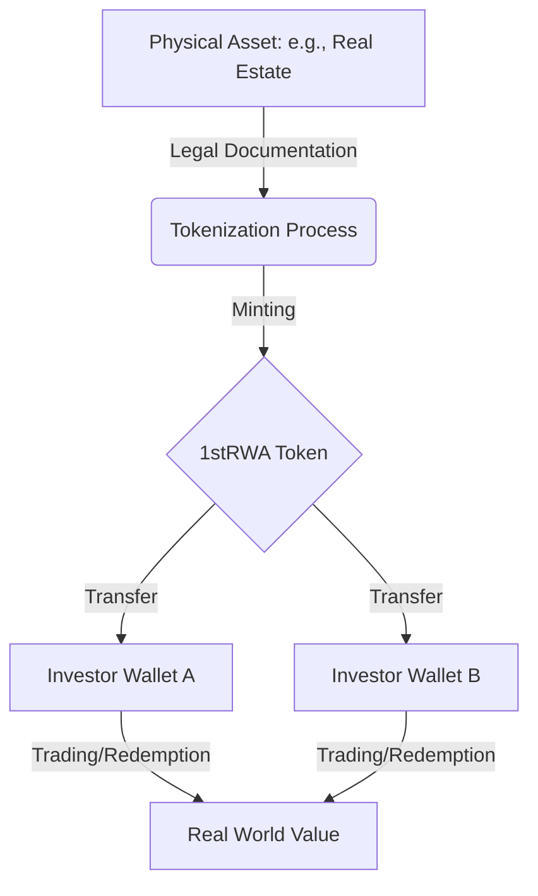

# Understanding MyFirstTokenERC20RWA

I am going to walk you through this smart contract step by step. I will use code snippets directly from the working contract to show you exactly how everything functions. This document is written for people who have never encountered blockchain technology before. I will build your understanding from the ground up.

## Quick Start: The Big Picture

Think of a **Real World Asset (RWA) Token** like a digital "title deed." Normally, if you own a piece of a building or a bar of gold, you have a paper contract. On the blockchain, we represent that ownership with a **token**.

1.  **Selection**: A physical asset (like real estate) is identified.
2.  **Tokenization**: We create a digital token (like `1stRWA`) that represents a specific share of that asset.
3.  **Ownership**: You hold the token in your digital wallet, proving your ownership. If the asset gains value, your token represents that gain.

### The RWA Lifecycle



## Before You Begin

To follow along with this project and interact with the dashboard, you will need:

1.  **A Digital Wallet**: Most people use **MetaMask**. It's a browser extension that acts as your ID and your bank on the blockchain.
2.  **Testnet Currency (Sepolia ETH)**: This project runs on the **Sepolia Test Network**. This is a "practice" blockchain where "money" is free. You can get some from a "faucet" (a website that gives away small amounts of test ETH).
3.  **Basic Understanding of "Gas"**: Every action on the blockchain (like sending tokens) costs a tiny amount of "Gas." On Sepolia, this is paid using your test ETH.

## Key Terms to Know

| Term | Simple Explanation |
| :--- | :--- |
| **Address** | Your digital "mailbox" (e.g., `0x123...`). It's where your tokens live. |
| **Mint** | Creating new tokens out of thin air (authorized roles only). |
| **Burn** | Destroying tokens (usually to redeem the underlying asset). |
| **Role** | Permission levels. Like having an "Admin" or "Moderator" badge. |
| **Transaction** | Any action that changes the blockchain state (costs gas). |
| **Smart Contract** | A program that lives on the blockchain and follows strict rules. |

## What Is This Token

This is called MyFirstTokenERC20RWA. The name tells us several things. It follows the ERC20 standard which means it behaves like other tokens you might have heard about such as USDC or DAI. The RWA part stands for Real World Asset. This means the token represents something tangible in the physical world. It could represent ownership of real estate, commodities, or other physical assets. The token exists on the blockchain but it connects to real value in our world.

The token symbol is 1stRWA and that appears in the constructor function on line 22. When I see this I understand this is the ticker symbol that will appear on wallets and exchanges.

```solidity
constructor(address defaultAdmin, address pauser, address minter, address freezer, address limiter, address recoveryAdmin)
    ERC20("MyFirstTokenERC20RWA", "1stRWA")
    ERC20Permit("MyFirstTokenERC20RWA")
{
```

## What Is A Smart Contract

A smart contract is simply a program that runs on a blockchain. Think of it like a vending machine. Once you deploy it, it follows its programmed rules without anyone being able to change them. The code here is written in Solidity which is the main language for Ethereum blockchain programs. When I deploy this contract it creates a new token that anyone can interact with according to the rules encoded here.

## Understanding The Imports

At the top of the file I see eight import statements. Each one brings in functionality from the OpenZeppelin library. OpenZeppelin is a widely used collection of secure smart contract components. I think of these as building blocks that have been tested by thousands of developers. Using these libraries means this token inherits battle-tested security patterns.

```solidity
import {ERC20Freezable} from "@openzeppelin/community-contracts/contracts/token/ERC20/extensions/ERC20Freezable.sol";
import {ERC20Restricted} from "@openzeppelin/community-contracts/contracts/token/ERC20/extensions/ERC20Restricted.sol";
import {AccessControl} from "@openzeppelin/contracts/access/AccessControl.sol";
import {ERC20} from "@openzeppelin/contracts/token/ERC20/ERC20.sol";
import {ERC1363} from "@openzeppelin/contracts/token/ERC20/extensions/ERC1363.sol";
import {ERC20Burnable} from "@openzeppelin/contracts/token/ERC20/extensions/ERC20Burnable.sol";
import {ERC20Pausable} from "@openzeppelin/contracts/token/ERC20/extensions/ERC20Pausable.sol";
import {ERC20Permit} from "@openzeppelin/contracts/token/ERC20/extensions/ERC20Permit.sol";
```

The ERC20 import provides the basic token functionality. This includes transferring tokens between accounts and checking balances. The other imports add special features on top of this base. The contract uses multiple inheritance which means it combines all these features into one token.

## ERC20Freezable - The Freezing Mechanism

ERC20Freezable adds the ability to freeze tokens in specific accounts. When I freeze an account I lock those tokens in place. The account can see the tokens but cannot move them. This is like putting a hold on a bank account. The underlying tokens still belong to that address but they are temporarily immobilized.

### The Frozen Balance Tracking

The contract maintains a mapping that tracks how many tokens are frozen per address. I see this on line 21 of ERC20Freezable.

```solidity
mapping(address account => uint256) private _frozenBalances;
```

This is a dictionary where the key is an Ethereum address and the value is the number of frozen tokens. This is private so users cannot manipulate it directly. Only the contract can modify it through authorized functions.

I notice the contract uses an underscore prefix for the mapping name. This is a Solidity convention indicating it is an internal implementation detail that should not be accessed directly by outside contracts.

### Reading Frozen and Available Balances

Two view functions let anyone check the freezing status. The frozen function on line 27 returns the total frozen amount for an address.

```solidity
function frozen(address account) public view virtual returns (uint256) {
    return _frozenBalances[account];
}
```

The available function on line 32 calculates how many tokens the account can actually use. It subtracts the frozen amount from the total balance.

```solidity
function available(address account) public view virtual returns (uint256) {
    (bool success, uint256 unfrozen) = Math.trySub(balanceOf(account), _frozenBalances[account]);
    return success ? unfrozen : 0;
}
```

I find this interesting because it uses Math.trySub instead of simple subtraction. The trySub function returns a boolean indicating if the subtraction succeeded without underflow. If the frozen amount is larger than the balance then the operation would underflow and return 0 instead of reverting. This is a safety pattern. It means if someone tries to freeze more tokens than the account owns, the available balance simply becomes zero. That seems like reasonable behavior.

### Setting the Freeze Amount

The internal _setFrozen function on line 38 modifies the frozen balance for an address.

```solidity
function _setFrozen(address account, uint256 amount) internal virtual {
    _frozenBalances[account] = amount;
    emit IERC7943Fungible.Frozen(account, amount);
}
```

This function is internal. That means only this contract or contracts that inherit from it can call it. Setting it to internal rather than external ensures that only authorized roles within the parent contract can trigger freezing. In MyFirstTokenERC20RWA the freeze function is public but restricted to the FREEZER_ROLE. That function then calls this internal _setFrozen.

The function emits an event. Events are important because they create a permanent record on the blockchain that anyone can search. The Frozen event is defined in an interface IERC7943Fungible. This is a standard interface for fungible tokens with freezing capabilities. Using a standard interface means wallets and block explorers can recognize and display these freezing events properly.

### Enforcing Freezes During Transfers

The real magic happens in the _update override on line 50. This function is called whenever tokens change hands.

```solidity
function _update(address from, address to, uint256 value) internal virtual override {
    if (from != address(0)) {
        uint256 unfrozen = available(from);
        require(unfrozen >= value, ERC20InsufficientUnfrozenBalance(from, value, unfrozen));
    }
    super._update(from, to, value);
}
```

The logic is straightforward. Before allowing any transfer from an address, I check if that address has enough unfrozen balance. The available() function tells me how many tokens are not locked. If the transfer amount exceeds the available balance, the transaction reverts with a custom error. Custom errors are more gas efficient than traditional require messages.

I notice the check only applies when from is not the zero address. The zero address is used for token minting. When new tokens are minted they come from address(0). Similarly, when tokens are burned they go to address(0). Minting and burning do not involve an actual account's frozen balance so those operations bypass the freeze check. This makes sense because minting creates new tokens out of thin air and burning destroys tokens. Neither action should be affected by a freeze on any particular account.

The check happens before calling super._update. This ensures no transfer occurs if the freeze check fails. Once the check passes, we call the parent implementation which handles the actual balance updates and emits the Transfer event.

### Why Freeze Balances Instead of Just Blocking Accounts

I could simply block an account from all transfers. But freezing specific amounts is more nuanced. An account might have multiple sources of tokens. Some might be legitimate and some suspicious. A partial freeze lets me lock only the problematic portion while leaving legitimate funds accessible. This is fairer to users and preserves usability during investigations.

### Standard Interface Compliance

The contract inherits from ERC20 and implements the IERC7943Fungible interface through the Frozen event. This interface is an Ethereum standard for tokens with freezing capabilities. By following this standard, the token remains compatible with wallets and DeFi protocols that understand these features.

## ERC20Restricted - User Access Control

ERC20Restricted implements account restrictions. This contract lets me control who can receive and send tokens. It introduces three restriction levels that determine an account's interaction abilities.

### The Restriction Enum

The heart of this contract is the Restriction enum on lines 16 through 20.

```solidity
enum Restriction {
    DEFAULT,   // User has no explicit restriction
    BLOCKED,   // User is explicitly blocked
    ALLOWED    // User is explicitly allowed
}
```

Enums in Solidity are user-defined types with named values. This enum has three states. DEFAULT means the account has no special restriction applied. BLOCKED means the account cannot send or receive tokens. ALLOWED means the account is explicitly permitted even if other logic might block them.

I like that the default is DEFAULT. This means new accounts start with no restriction. Restrictions must be actively applied. This is important because it means I do not need to maintain an allowlist by default. I can block specific bad actors without affecting everyone else.

### The Restrictions Mapping

A private mapping stores each address's restriction level on line 22.

```solidity
mapping(address account => Restriction) private _restrictions;
```

This is similar to the frozen balances mapping but it stores enum values instead of numbers. The mapping is private so external contracts must use the provided getter functions to read it.

### The UserRestrictionsUpdated Event

Whenever a restriction changes, the contract emits this event on line 25.

```solidity
event UserRestrictionsUpdated(address indexed account, Restriction restriction);
```

The account parameter is indexed. Indexed parameters can be searched efficiently in logs. This means compliance tools can quickly find all restriction changes for a specific account. The restriction parameter shows the new level. Having an event for every change creates an auditable trail. Regulators can see when accounts were blocked or allowed and by whom.

### Getting an Account's Restriction

The getRestriction function on line 31 is a public view function that returns the restriction enum for any address.

```solidity
function getRestriction(address account) public view virtual returns (Restriction) {
    return _restrictions[account];
}
```

This allows anyone to check if an account is blocked, allowed, or default. Transparency is valuable for compliance. If I receive tokens from an address, I can verify that address is not restricted. If I am considering transacting with someone, I can check their status first.

### The canTransact Check

The canTransact function on line 48 determines whether an account can currently interact with the token.

```solidity
function canTransact(address account) public view virtual returns (bool) {
    return getRestriction(account) != Restriction.BLOCKED; // i.e. DEFAULT && ALLOWED
}
```

This is the central gatekeeper function. By default it returns true for DEFAULT and ALLOWED accounts, false only for BLOCKED. This creates a blocklist system out of the box. Only explicitly blocked accounts are prevented from transacting.

The comment shows that I can override this function to implement an allowlist instead. In MyFirstTokenERC20RWA, the contract overrides canTransact to require Restriction.ALLOWED. That turns the system into an allowlist. Only accounts explicitly granted ALLOWED status can transact. This is crucial for regulated RWA tokens where only verified investors can participate.

I appreciate the virtual keyword on this function. It means child contracts can change the logic. This makes the contract flexible. The base provides a sensible default (blocklist) but I can customize it for stricter requirements (allowlist).

### The _update Enforcement

Just like ERC20Freezable, this contract overrides _update to enforce its rules during every transfer. The implementation on lines 60 through 64 checks both the sender and recipient.

```solidity
function _update(address from, address to, uint256 value) internal virtual override {
    if (from != address(0)) _checkRestriction(from); // Not minting
    if (to != address(0)) _checkRestriction(to); // Not burning
    super._update(from, to, value);
}
```

I check the from address unless it is address(0) which indicates minting. Minting creates tokens from nothing so the sender is not restricted. I check the to address unless it is address(0) which indicates burning. Burning destroys tokens so the recipient does not need restrictions.

The _checkRestriction helper on lines 93 through 95 simply requires that canTransact returns true.

```solidity
function _checkRestriction(address account) internal view virtual {
    require(canTransact(account), ERC20UserRestricted(account));
}
```

If the account fails the check, the transaction reverts with the ERC20UserRestricted custom error. This gives a clear reason why the transfer failed.

### Convenience Functions for Setting Restrictions

The contract provides several internal helper functions for modifying restrictions. They all delegate to _setRestriction on line 70.

```solidity
function _setRestriction(address account, Restriction restriction) internal virtual {
    if (getRestriction(account) != restriction) {
        _restrictions[account] = restriction;
        emit UserRestrictionsUpdated(account, restriction);
    } // no-op if restriction is unchanged
}
```

Notice the if check prevents unnecessary storage writes if the restriction is already set to that value. This saves gas. It also prevents emitting duplicate events. Only actual changes trigger the UserRestrictionsUpdated event.

Three convenience wrappers exist:

_blockUser sets restriction to BLOCKED (line 78)
_allowUser sets restriction to ALLOWED (line 83)
_resetUser sets restriction to DEFAULT (line 88)

These have descriptive names that make the calling code more readable. In MyFirstTokenERC20RWA the allowUser and disallowUser functions are public and exposed to the LIMITER_ROLE. They call _allowUser and _resetUser respectively.

### Why Three States and Not Just Two

I could implement blocking with a boolean mapping where true means blocked. But having three states gives me more flexibility. DEFAULT means I have never made a decision about this account. ALLOWED means I have explicitly approved this account. BLOCKED means I have explicitly denied this account.

The three state system supports both blocklist and allowlist patterns. In a blocklist, new accounts are DEFAULT and can transact unless someone blocks them. In an allowlist, the parent contract overrides canTransact to require ALLOWED, which means new accounts cannot transact until someone approves them. Three states support both approaches without changing the data structure.

### Compliance and Regulatory Benefits

The Restriction enum aligns well with real world compliance requirements. Regulatory frameworks often require knowing if a user is verified. The ALLOWED state represents verification. The BLOCKED state represents sanctioned or problematic accounts. The DEFAULT state gives me a way to track accounts I have not yet reviewed.

The ability to query restrictions via getRestriction means off-chain systems can enforce additional checks before even attempting a transaction. Wallets can warn users if they try to send tokens to a restricted account. Compliance software can monitor changes in restriction status.

## The Role System

Right after the imports I see six role definitions. These are the keys to the kingdom. They determine who can perform special administrative functions. Notice that each role is created using keccak256 hashing. This produces a unique bytes32 identifier that represents each role.

```solidity
bytes32 public constant PAUSER_ROLE = keccak256("PAUSER_ROLE");
bytes32 public constant MINTER_ROLE = keccak256("MINTER_ROLE");
bytes32 public constant FREEZER_ROLE = keccak256("FREEZER_ROLE");
bytes32 public constant LIMITER_ROLE = keccak256("LIMITER_ROLE");
bytes32 public constant RECOVERY_ROLE = keccak256("RECOVERY_ROLE");
```

The AccessControl library manages these roles. The contract itself exposes the role constants as public variables so anyone can check which addresses hold which roles. This creates transparency about who has administrative powers.

The roles serve these purposes:

| Role | Can Do This | Why It Matters |
|------|-------------|----------------|
| MINTER_ROLE | Create new tokens | Only authorized people can increase token supply for real asset purchases |
| PAUSER_ROLE | Stop all transfers | Emergency brake to protect users during attacks or bugs |
| FREEZER_ROLE | Freeze specific accounts | Prevent malicious actors from moving stolen tokens |
| LIMITER_ROLE | Control who can receive tokens | Ensure compliance with regulations about who can hold the token |
| RECOVERY_ROLE | Move tokens between accounts | Rescue tokens sent to wrong addresses or recover from compromised accounts |
| DEFAULT_ADMIN_ROLE | Grant and revoke other roles | Central oversight of the entire permission system |

The DEFAULT_ADMIN_ROLE comes from the AccessControl library itself. This is the super admin role that can manage all other roles.

## The Constructor Setting Up Permissions

The constructor runs only once when the contract is first deployed. This is where the initial administrative team gets their permissions. I notice the constructor requires six different addresses as parameters. Each address receives a specific role.

```solidity
constructor(address defaultAdmin, address pauser, address minter, address freezer, address limiter, address recoveryAdmin)
    ERC20("MyFirstTokenERC20RWA", "1stRWA")
    ERC20Permit("MyFirstTokenERC20RWA")
{
    _grantRole(DEFAULT_ADMIN_ROLE, defaultAdmin);
    _grantRole(PAUSER_ROLE, pauser);
    _grantRole(MINTER_ROLE, minter);
    _grantRole(FREEZER_ROLE, freezer);
    _grantRole(LIMITER_ROLE, limiter);
    _grantRole(RECOVERY_ROLE, recoveryAdmin);
}
```

The _grantRole function comes from the AccessControl library. This function assigns a role to an address. Once deployed these initial holders can perform their designated functions. The DEFAULT_ADMIN_ROLE holder has the power to grant and revoke other roles later. This allows the admin to change the team composition without deploying a new contract.

## The Public Functions Everyone Can Call

Now I look at the functions that any user can call to interact with the token. These follow standard ERC20 patterns plus some extra features.

The pause function on line 33 allows the designated pauser to stop all token transfers. This is a global emergency switch. When I call this function it sets an internal pause flag. While paused, no transfers happen anywhere in the system. The unpause function reverses this. The onlyRole modifier ensures only the PAUSER_ROLE holder can execute these functions.

```solidity
function pause() public onlyRole(PAUSER_ROLE) {
    _pause();
}

function unpause() public onlyRole(PAUSER_ROLE) {
    _unpause();
}
```

The mint function on line 41 creates new tokens and assigns them to a specified address. Minting increases the total supply. This function is crucial for an RWA token because when the organization buys a new real world asset they need to mint tokens representing that asset to give to investors. The MINTER_ROLE restriction ensures only authorized personnel can create tokens.

```solidity
function mint(address to, uint256 amount) public onlyRole(MINTER_ROLE) {
    _mint(to, amount);
}
```

The freeze function on line 45 locks tokens in a specific account. When I freeze an account the tokens remain in that address but cannot be moved. This is useful when we discover suspicious activity. The FREEZER_ROLE holder can freeze problematic accounts while investigations happen.

```solidity
function freeze(address user, uint256 amount) public onlyRole(FREEZER_ROLE) {
    _setFrozen(user, amount);
}
```

The allowUser and disallowUser functions on lines 53 and 57 control who can receive tokens. The LIMITER_ROLE holder maintains an allowlist. Only accounts on this allowlist can receive tokens. This enables regulatory compliance since some jurisdictions restrict who can hold certain types of tokens. The isUserAllowed function on line 49 lets anyone check if an address is permitted.

```solidity
function isUserAllowed(address user) public view returns (bool) {
    return getRestriction(user) == Restriction.ALLOWED;
}

function allowUser(address user) public onlyRole(LIMITER_ROLE) {
    _allowUser(user);
}

function disallowUser(address user) public onlyRole(LIMITER_ROLE) {
    _resetUser(user);
}
```

The forcedTransfer function on line 61 allows the RECOVERY_ROLE holder to move tokens between any two accounts regardless of normal restrictions. This acts as a recovery mechanism. If someone sends tokens to a wrong address or if an account gets compromised, the recovery admin can transfer those tokens to safety.

```solidity
function forcedTransfer(address from, address to, uint256 amount) public onlyRole(RECOVERY_ROLE) {
    _transfer(from, to, amount);
}
```

## The Internal Override Functions

Lines 67 through 76 contain override functions. These are required because we are inheriting from multiple contracts that all define the same internal functions. The Solidity compiler needs us to explicitly specify which parent implementation we want to use in our override chain.

```solidity
function _update(address from, address to, uint256 value)
    internal
    override(ERC20, ERC20Pausable, ERC20Freezable, ERC20Restricted)
{
    super._update(from, to, value);
}
```

The _update function is called whenever tokens move from one account to another. By overriding it and calling super._update we ensure that all the parent contract checks run in sequence. The pausable parent checks if transfers are paused. The freezable parent checks if the sender has frozen tokens. The restricted parent checks if the recipient is allowed to receive tokens. These checks happen automatically every time someone tries to transfer tokens.

The canTransact function on line 74 implements an interface requirement from the ERC20Restricted contract. It returns false if the user cannot send or receive tokens. This allows wallets and applications to check an account's status before initiating transfers.

```solidity
function canTransact(address user) public view override returns (bool) {
    return getRestriction(user) == Restriction.ALLOWED;
}
```

The supportsInterface function on line 78 makes this contract properly report which standards it supports. This is important for wallets and other contracts that need to detect capabilities. By overriding we ensure the interface detection works correctly across all inherited contracts.

```solidity
function supportsInterface(bytes4 interfaceId)
    public
    view
    override(AccessControl, ERC1363)
    returns (bool)
{
    return super.supportsInterface(interfaceId);
}
```

## How The Pieces Work Together

When I look at this contract as a whole I see a carefully designed system for managing real world asset tokens. The basic ERC20 functionality provides the token mechanics everyone expects. The pausable extension adds an emergency stop. The freezable extension lets us lock suspicious accounts. The restricted extension maintains an allowlist for regulatory compliance. The burnable extension lets token holders destroy their tokens when they want to redeem the underlying asset. The permit extension saves gas by allowing offline approvals. The ERC1363 extension adds token callback functions that enable more complex interactions. The AccessControl system manages all the administrative permissions.

Each feature has a corresponding role that controls access. No single person has unilateral power. The system requires multiple role holders to coordinate for major actions. This creates checks and balances while maintaining operational flexibility.

The contract does not include a mechanism to adjust roles after deployment except through the DEFAULT_ADMIN_ROLE using the AccessControl functions. This means the admin can reassign responsibilities as team members change.

## How These Two Contracts Work Together

In MyFirstTokenERC20RWA both contracts are inherited and both override _update. The MyFirstTokenERC20RWA contract also overrides _update to call super._update with all the parents specified.

```solidity
function _update(address from, address to, uint256 value)
    internal
    override(ERC20, ERC20Pausable, ERC20Freezable, ERC20Restricted)
{
    super._update(from, to, value);
}
```

This creates a chain. When a transfer happens, this _update calls super._update which goes through each parent's _update in order. ERC20Pausable checks if transfers are paused. ERC20Freezable checks if the sender has enough available balance. ERC20Restricted checks if both sender and recipient are allowed. Finally the base ERC20 updates the balances.

All these checks must pass for a transfer to succeed. This layered security model gives me fine-grained control over token movements. I can pause the entire system, freeze specific accounts, and restrict who can hold the token. That is exactly what a regulated asset needs.

### Error Messages Guide Users

Each contract defines custom errors that provide clear reasons for failures. ERC20Freezable defines ERC20InsufficientUnfrozenBalance. ERC20Restricted defines ERC20UserRestricted. These errors appear in transaction revert messages. Users and developers can read these to understand why their transaction failed. Was it a freeze? A restriction? A pause? The error tells them.

### Storage Layout Considerations

Both contracts store their own mappings. ERC20Freezable has _frozenBalances. ERC20Restricted has _restrictions. These occupy separate storage slots. The Solidity compiler automatically calculates storage positions to avoid collisions between parent contracts. This means I can safely inherit both without worrying about them overwriting each other's data.

### Gas Costs

Every additional check adds gas cost to transfers. The freeze check requires reading the frozen balance and doing a subtraction. The restriction check requires two lookups (for from and to) and a comparison. This overhead is minimal but measurable. For a regulated token this is an acceptable cost because the benefits far outweigh the few extra gas units per transfer.

### Extensibility Through Virtual Functions

All the key functions are marked virtual. This allows my main contract to customize behavior. For canTransact I override to require ALLOWED instead of the default NOT_BLOCKED. This is how I convert the blocklist into an allowlist. The _setFrozen function is also virtual so I could add additional logic like logging or secondary checks if needed.

The virtual nature makes these contracts reusable building blocks. I can start with the defaults and then override only what I need to change for my specific use case.

### Separation of Concerns

I appreciate that OpenZeppelin separated freezing and restriction into two different contracts. They are conceptually distinct. Freezing is about temporarily immobilizing specific amounts of tokens on an account that otherwise can transact. Restrictions are about whether an account can transact at all. Combining them would create a more complex design. Separating them lets me choose which features I need.

MyFirstTokenERC20RWA uses both because RWA tokens typically need both capabilities. But a simpler token might only need one or the other.

## Real World Usage Patterns

When I think about how these contracts work in practice, I imagine several scenarios. A compliance officer identifies a suspicious account. They use the freeze function to lock that account's tokens while an investigation happens. The account cannot move those tokens but can still receive more (which might also get frozen if problematic). This allows the investigation to continue without losing evidence.

A regulator provides a list of approved investor addresses. The limiter uses allowUser to add each address to the allowlist. New investors cannot receive tokens until they go through the verification process and get added. This prevents unauthorized users from acquiring the token.

A major bug is discovered in a related contract. The pauser immediately pauses all transfers. While paused, no one can move tokens. This prevents attackers from exploiting the bug to drain assets. Once the bug is fixed, the pauser unpauses and normal operations resume.

An investor accidentally sends tokens to a dead address with no private key. The recovery admin uses forcedTransfer to move those tokens to a new address that the investor controls. This rescues the assets without needing the private key of the original dead address.

All these scenarios become possible because of the controlled access patterns these two contracts provide. They transform a simple ERC20 token into a governance-aware, compliance-ready instrument.

## What Makes This Suitable For Real World Assets

RWA tokens need to comply with real world regulations. The allowlist system ensures only approved participants can hold tokens. The freeze function helps respond to legal orders or investigations. The pausable function provides an emergency response capability. The recovery function allows fixing mistakes that would otherwise result in lost assets.

The minting restriction ensures new tokens only appear when backed by real assets. The burning capability allows token redemption when underlying assets get sold or withdrawn. Together these create a closed loop that maintains economic integrity.

I notice the contract does not include any oracle or asset backing verification. That would need to happen off-chain or in companion contracts. This token focuses on the transfer and permission mechanics while leaving asset custody to separate systems.

## Security Considerations

The role separation design prevents any single account from having too much power. However I would want to see the deployment process use multi-signature wallets for each role. The initial admin addresses should be secured with proper key management.

The pausable feature is necessary for compliance but it creates centralization risk. I would want to understand who controls the pauser role and under what circumstances they would exercise that power. The same applies to all other privileged roles.

The forcedTransfer function could be abused if the recovery admin becomes malicious. This role should also be held by a multi-signature wallet or a decentralized autonomous organization.

## Next.js Frontend Implementation

Now let's examine how to interact with this token contract from a Next.js application. The frontend uses Wagmi and RainbowKit for wallet connectivity and contract interactions. The implementation consists of three key components:

### Wagmi Configuration

The wagmi configuration sets up blockchain connectivity using RainbowKit's default configuration:

```typescript
import { getDefaultConfig } from '@rainbow-me/rainbowkit';
import { sepolia } from 'wagmi/chains';

export const config = getDefaultConfig({
  appName: 'RainbowKit App',
  projectId: 'YOUR_PROJECT_ID',
  chains: [sepolia],
  ssr: true,
});
```

This configuration connects to the Sepolia testnet with wallet connection support. Replace `YOUR_PROJECT_ID` with your actual WalletConnect project ID. The `ssr: true` option enables server-side rendering support.

### Custom Hook: useRwaToken

The `useRwaToken` hook (located in `nextjs/src/hooks/useRwaToken.ts`) provides a comprehensive interface for all token operations. It wraps Wagmi's contract hooks and adds event monitoring and role-based access control.

#### Role Constants

```typescript
export const ROLES = {
  ADMIN: '0x0000000000000000000000000000000000000000000000000000000000000000',
  PAUSER: '0x65d175404fa3028d689658516d25816fd5656ca895101662c19e5d6d9c49caee',
  MINTER: '0x9f2df0da571034f45f091cd2003c23de3b02005f0373d5494191c0453d862f92',
  FREEZER: '0xe1db091c5213600bef1832049e6f3d9ed360e2ce1c28c89d2d0b5713437c6883',
  LIMITER: '0x272b380bf9d2d9ab04f2f099f6f34e3215904bb61480f27f00e57204481358da',
  RECOVERY: '0x8110b930d413348003612807f7c66cb17c2f0d61efb5e5fb595f560e7ee68058',
} as const;
```

These are the keccak256 hashes of the role names as defined in the contract.

#### Read Hooks

The hook exposes multiple read hooks for querying contract state:

```typescript
// Balance of any address
const { data: balance } = useTokenBalance(userAddress);

// Total token supply
const { data: supply } = useTokenSupply();

// Whether a user is allowed to transact (allowlist check)
const { data: isAllowed } = useIsUserAllowed(userAddress);

// Contract paused status
const { data: isPaused } = usePaused();

// Frozen amount for an address
const { data: frozenAmt } = useFrozenAmount(userAddress);

// Check if address has a specific role
const { data: hasMinter } = useHasRole(ROLES.MINTER, userAddress);

// Token decimals (returns 18)
const { data: decimals } = useTokenDecimals();
```

All read hooks automatically refetch at intervals (typically every 5 seconds) to keep the UI in sync with blockchain state.

#### Write Actions

The hook provides action functions for all token operations:

```typescript
// Administrative actions (require roles)
mint(to: string, amount: bigint)     // MINTER_ROLE
freeze(user: string, amount: bigint) // FREEZER_ROLE
allowUser(user: string)              // LIMITER_ROLE
disallowUser(user: string)           // LIMITER_ROLE
pause()                              // PAUSER_ROLE
unpause()                            // PAUSER_ROLE
forcedTransfer(from, to, amount)     // RECOVERY_ROLE

// Standard token actions (available to all users)
transfer(to: string, amount: bigint)
burn(amount: bigint)
burnFrom(account, amount)    // Requires prior approval
approve(spender, amount)
transferFrom(from, to, amount) // Requires prior approval
```

Each action returns a transaction hash through the `writeContract` function from Wagmi. The hook also tracks pending states:

```typescript
const {
  isWritePending,    // Transaction submitted but not confirmed
  isConfirming,      // Transaction is being confirmed on-chain
  isConfirmed,       // Transaction confirmed
  writeError,        // Any error from the write operation
  hash               // Current transaction hash
} = useRwaToken();
```

#### Event Monitoring

The hook automatically monitors contract events and maintains a list of the most recent ones:

```typescript
const { events } = useRwaToken();

// Each event object contains:
// - eventName: 'Transfer', 'Mint', 'Freeze', etc.
// - args: decoded event parameters
// - transactionHash, blockNumber, etc.
```

This enables an activity feed that shows all token operations in real-time.

### Dashboard Page

The main dashboard (`nextjs/src/pages/dashboard.tsx`) provides a full-featured interface for interacting with the token. It's organized into tabs: Overview, Transfer, Supply, and Activity.

#### Tab Structure

```typescript
type TabType = 'overview' | 'transfer' | 'supply' | 'activity';
```

#### Overview Tab

The overview displays user balance, total supply, frozen amount, and allowlist status. It also shows which administrative roles the connected user holds:

```tsx
<div className={styles.rolesPanel}>
  <h3>Your Roles</h3>
  <div className={styles.rolesGrid}>
    {Object.entries(ROLES).map(([name, hash]) => (
      <div key={name} className={`${styles.roleBadge} ${rolesStatus[name] ? styles.roleBadgeActive : ''}`}>
        {name}
      </div>
    ))}
  </div>
</div>
```

Based on the user's roles, administrative action cards appear: Manage Allowlist, Freeze Balance, and Recovery Transfer.

#### Transfer Tab

Provides three standard token operations:

```tsx
// 1. Quick Transfer - send tokens to any address
transfer(to, parseAmount(amount));

// 2. Approve Spender - grant spending allowance
approve(spender, parseAmount(amount));

// 3. Transfer From - transfer from another account (after approval)
transferFrom(from, to, parseAmount(amount));
```

All transfer actions check `isAllowed` status and disable the interface if the user is restricted:

```tsx
disabled={!isAllowed}
```

#### Supply Tab

Provides minting and burning operations. The mint button only appears if the user has MINTER_ROLE:

```tsx
{canMint && (
  <ActionCard
    title="Mint New Tokens"
    onAction={() => mint(formData.mintTo, parseAmount(formData.mintAmount))}
    ...
  />
)}
```

Burning is available to all token holders:

```tsx
// Burn your own tokens
burn(parseAmount(burnAmount));

// Burn from another account (requires allowance)
burnFrom(account, parseAmount(amount));
```

#### Activity Tab

Displays a real-time list of all contract events using the monitored events from the hook:

```tsx
<EventLogList events={events} />
```

### Data Flow

The application uses a unified pattern for all interactions:

1. **Read operations** use `useReadContract` with automatic refetching
2. **Write operations** use `useWriteContract` wrapped in `useCallback` to prevent unnecessary re-renders
3. **Transaction states** are tracked with `useWaitForTransactionReceipt` to show confirmation progress
4. **Event monitoring** uses `useWatchContractEvent` with polling to maintain an up-to-date activity log

This architecture provides a responsive, real-time interface for managing the RWA token with proper error handling and loading states throughout.

### Using the Dashboard

To use the dashboard:

1.  Connect your wallet using the RainbowKit connect button
2.  Ensure you have tokens on Sepolia testnet (or your configured chain)
3.  Navigate between tabs to access different features
4.  The UI automatically shows/hides admin functions based on your contract roles
5.  All transactions require wallet confirmation and show progress indicators

The dashboard demonstrates how the token's advanced features (freezing, allowlist, recovery transfers) are accessible through a clean web interface while maintaining proper access control at the contract level.

### Understanding the Wallet Experience

For a beginner, the most important thing to realize is that **the website doesn't "own" your tokens**. Your wallet (MetaMask) does. 

- **The Popup**: Whenever you click a button like "Mint" or "Transfer," your browser will show a MetaMask popup. This is the blockchain asking: *"Are you sure you want to do this, and are you willing to pay the gas fee?"*
- **The Wait**: Unlike a regular website, blockchain actions aren't instant. You'll see "Pending" or "Confirming" states. This is the network nodes working to include your transaction in a "block."
- **The Gas Fee**: Even though you are on a testnet, you still "pay" for the computation. This is why you need Sepolia ETH. If you run out, your transactions will fail!

## What's Next?

Congratulations! You've navigated through the architecture of a Real World Asset token and its frontend dashboard. To truly master this, I recommend:

1.  **Try it out**: Use the dashboard to mint some tokens to your own address.
2.  **Break it**: Try to call an admin function (like `pause`) from a different wallet address that doesn't have the `PAUSER_ROLE`. See the error message!
3.  **Explore the Code**: Look at `MyFirstTokenERC20RWA.sol` in the `hardhat2/contracts` folder. You'll see how the logic we discussed is implemented line-by-line.
4.  **Check the Explorer**: After a transaction, click the transaction hash to see it on **Etherscan**. This is the public ledger where everything is recorded forever.

ERC20Freezable and ERC20Restricted are elegant solutions to real world regulatory needs.
 The freezing mechanism lets me immobilize specific token amounts while leaving the remainder accessible. The restriction system lets me control which accounts can participate. Both contracts integrate seamlessly with ERC20 by overriding the internal _update function that every transfer goes through.

The use of custom errors, events, and standard interfaces makes these contracts developer friendly. The virtual functions make them customizable. The separation of concerns keeps each contract focused on one responsibility.

For someone building a token that represents real world assets, these contracts provide essential guardrails. They give me the tools to respond to legal requirements, security incidents, and operational needs while maintaining the trustlessness and transparency that blockchain technology provides.