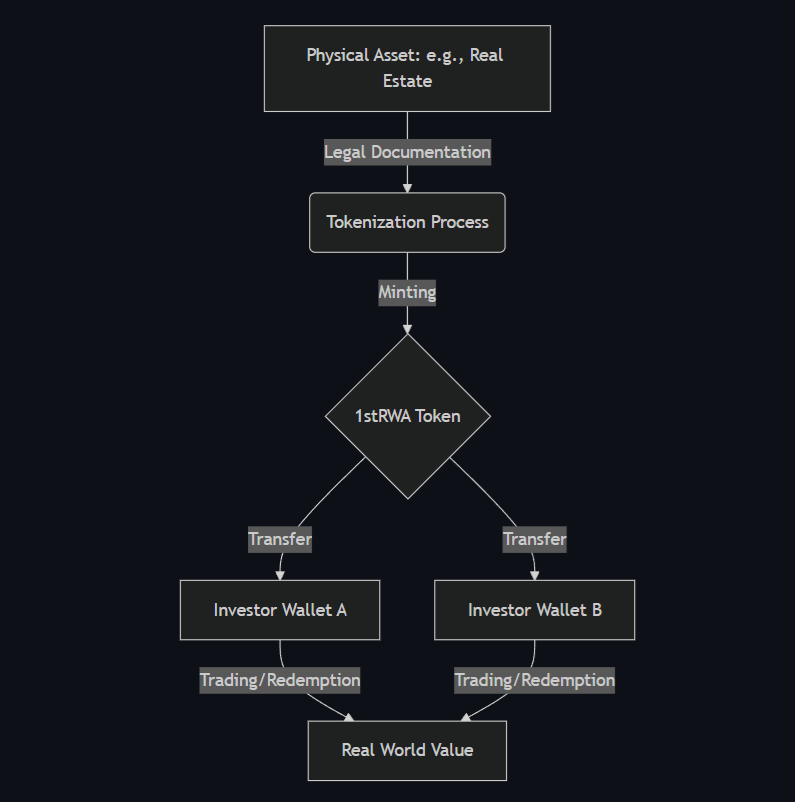
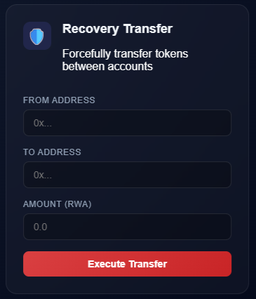
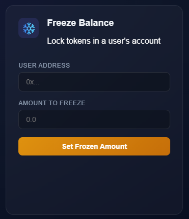
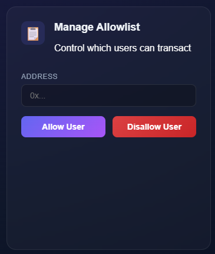
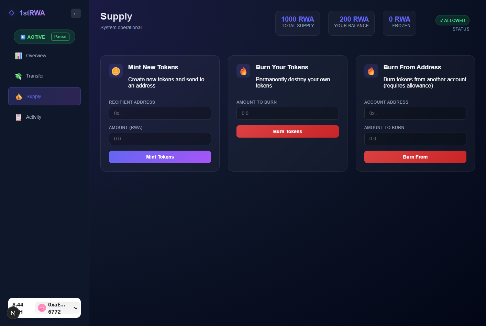
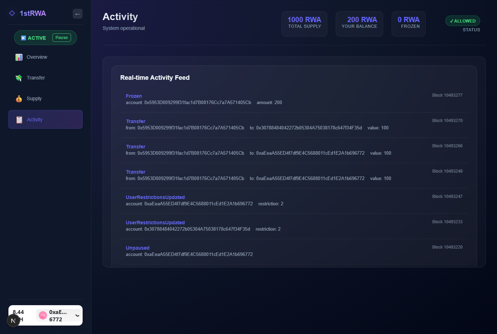

# RWA Token Management Dashboard


This is a premium, real-time dashboard for interacting with the `MyFirstTokenERC20RWA` smart contract. It provides a comprehensive interface for administrators and users to manage and monitor the token's lifecycle.



## Features

- **Real-time Event Feed**: Live monitoring of contract events using `useWatchContractEvent`.
- **Role-Based Interaction**: Dynamic UI that adapts based on the user's roles (Admin, Minter, Freezer, etc.).
- **Compliance Controls**: Integrated forms for freezing balances, managing allowlists, and forced transfers.
- **Premium Design**: Modern glassmorphism aesthetic with responsive layouts and vibrant gradients.
- **Live Data**: Automatic polling (every 5 seconds) for token supply and user balances.

## Operations

### Recovery Transfer
Allows administrators to transfer tokens from a frozen or compromised address to a new safe address, ensuring asset recovery while maintaining compliance.


*Figure 1: Recovery transfer management interface*

### Freeze Balance
Enables admins to immediately freeze token balances for specific addresses, preventing unauthorized transfers and maintaining regulatory compliance.


*Figure 2: Freeze token balance management interface*

### Allowlist Management
Provides tools to manage whitelist functionality, controlling which addresses are authorized to hold or transfer RWA tokens.


*Figure 3: Allowlist and access control management*

# Screenshots

### Supply Management
Interface for minting and burning tokens with real-time supply monitoring.


*Figure 4: Token supply management interface*

### Activity Feed
Live event log displaying all contract interactions and token transfers.


*Figure 5: Contract activity event log*

## Getting Started

First, install the dependencies:

```bash
npm install
```

Then, run the development server:

```bash
npm run dev
```

Open [http://localhost:3000](http://localhost:3000) with your browser to see the main page. Click the **RWA Dashboard** card to enter the management interface.

## 🛠 Tech Stack

- **Framework**: [Next.js](https://nextjs.org/)
- **Wallet Connection**: [RainbowKit](https://rainbowkit.com)
- **Contract Hooks**: [wagmi](https://wagmi.sh)
- **Ethereum Library**: [viem](https://viem.sh)

## 📁 Project Structure

- `src/pages/dashboard.tsx`: Main dashboard coordinator.
- `src/hooks/useRwaToken.ts`: Custom hook for all contract interactions.
- `src/components/DashboardComponents.tsx`: Modular UI elements (KISS/DRY).
- `src/styles/Dashboard.module.css`: Glassmorphism design system.

## Learn More

To learn more about the underlying technologies:
- [wagmi Documentation](https://wagmi.sh) - Learn how to interact with Ethereum.
- [RainbowKit Documentation](https://rainbowkit.com) - Learn how to customize your wallet connection flow.
